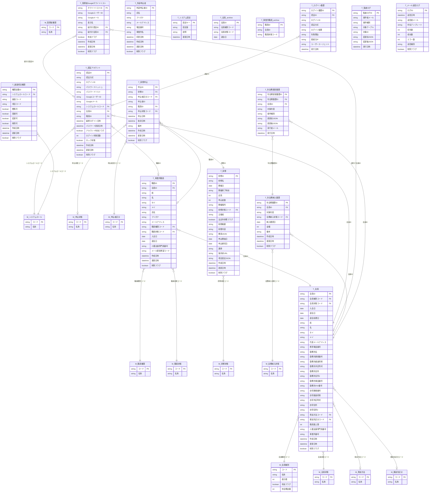

# データモデル設計書（スプレッドシートDB版）

更新日: 2026-04-24
スキーマバージョン: 2026-04-24-01

---

## 1. 設計方針

- JSON列へ丸ごと保存する方式は採用しない（設定値のみJSON列を例外的に使用する）。
- スプレッドシートを「マスタ」と「トランザクションテーブル」に分割する。
- 1シート1責務、1行1レコード、主キー/外部キー列を明示する。
- 列名・マスタ名・テーブル名はすべて日本語命名とする。

### スプレッドシート構成（v261〜）

| スプレッドシート | 役割 | ID |
|---|---|---|
| **メイン DB** | 会員・研修・認証データ | `1GVlIzOG1Tsqw8fBXgZ__c8u4oMu-4_WCf0H3aVLESKs` |
| **ログ SS** | ログイン履歴・監査ログ・メール送信ログ | `1NmVv483UeehF8dqCdyNKOqOtv_fPKROhHN7011N23lw` |

ログ SS は `getLogSs_()` 経由でアクセスする。`LOG_SPREADSHEET_ID` スクリプトプロパティが未設定の場合はメイン DB にフォールバックする（安全移行）。

---

## 2. Mermaid ER 図



---

## 3. マスタ一覧

### 3.1 `M_会員種別`
- 用途: 会員の区分管理
- 列: `コード`, `名称`, `表示順`, `有効フラグ`, `年会費金額`
- 初期値:
  - `INDIVIDUAL`（個人会員, 3,000円）
  - `BUSINESS`（事業所会員, 8,000円）
  - `SUPPORT`（賛助会員, 5,000円）

### 3.2 `M_会員状態`
- 用途: 会員状態の管理
- 列: `コード`, `名称`, `表示順`, `有効フラグ`
- 初期値: `ACTIVE`（有効）, `WITHDRAWAL_SCHEDULED`（退会予定）, `WITHDRAWN`（退会）

### 3.3 `M_発送方法`
- 用途: 通知媒体（メール/郵送）
- 列: `コード`, `名称`, `表示順`, `有効フラグ`

### 3.4 `M_郵送先区分`
- 用途: 定期郵送先（自宅/勤務先）
- 列: `コード`, `名称`, `表示順`, `有効フラグ`

### 3.5 `M_職員権限`
- 用途: 事業所職員の権限（3階層）
- 初期値:
  - `REPRESENTATIVE`（代表者）: 職員の追加・削除、代表者変更が可能
  - `ADMIN`（管理者）: 職員の追加・削除が可能（代表者の変更は不可）
  - `STAFF`（一般）: 自分の情報のみ閲覧・編集可能

### 3.6 `M_職員状態`
- 用途: 在籍/退職
- 列: `コード`, `名称`, `表示順`, `有効フラグ`

### 3.7 `M_システムロール`
- 用途: ログイン主体ごとのシステム権限
- 初期値: `OFFICE_ADMIN`, `INDIVIDUAL_MEMBER`, `BUSINESS_ADMIN`, `BUSINESS_MEMBER`

### 3.8 `M_研修状態`
- 初期値: `OPEN`（受付中）, `CLOSED`（受付終了）

### 3.9 `M_申込状態`
- 用途: 申込状態（申込済/取消）

### 3.10 `M_会費納入状態`
- 用途: 年会費の納入状態

### 3.11 `M_申込者区分`
- 用途: 研修申込者が会員か非会員かを区別
- 初期値: `MEMBER`（会員）, `EXTERNAL`（非会員）

### 3.12 `M_管理者権限`
- 用途: 管理画面の権限レベル管理

---

## 4. テーブル詳細

### 4.1 `T_会員` — メインDB

主キー: `会員ID`

| フィールド | 個人会員 | 事業所会員 | 賛助会員 |
|---|---|---|---|
| 姓/名/セイ/メイ | 必須 | ブランク | 必須 |
| 介護支援専門員番号 | 必須（8桁半角数字） | ブランク | 任意 |
| 勤務先名〜住所2 | 郵送先=OFFICE時は名前必須、住所2任意 | 基本情報として使用 | 同左 |
| 自宅住所系 | 郵送先=HOME時に使用 | 使用しない | 郵送先=HOME時に使用 |
| 発送方法/郵送先区分 | 使用 | ブランク | 使用 |
| 事業所番号 | 使用しない | 必須（半角英数字10文字） | 使用しない |

- `退会処理日`：退会手続き実施日。`退会日` は年度末 3/31 を自動計算。
- `勤務先住所2` / `自宅住所2`：建物名・部屋番号（任意）。v261 で入会申込フォームに追加。
- `事業所番号` による二重登録防止（公開ポータル申込時）。

### 4.2 `T_事業所職員` — メインDB

外部キー: `会員ID` → `T_会員`

- `職員権限コード='REPRESENTATIVE'` の行が事業所代表者情報の正本。
- `姓`/`名`/`セイ`/`メイ` が構造化列の正本。`氏名`/`フリガナ` は表示用スナップショット。
- `メール配信希望コード`（YES/NO）: 特定電子メール法オプトイン準拠。

### 4.3 `T_認証アカウント` — メインDB

- 会員ログイン: `認証方式='PASSWORD'` / `ログインID + ハッシュ+ソルト`
- 管理者ログイン: `認証方式='GOOGLE'` / `Session.getActiveUser()` + ホワイトリスト照合
- パスワード平文は保存しない。
- v118 以降 GoogleユーザーID（sub）照合は廃止。Googleメールで照合。

### 4.4 `T_管理者Googleホワイトリスト` — メインDB

- 追加・更新・削除時は `admin_wl_v1` / `admin_auth_v1` キャッシュを即時無効化。
- 紐付け不整合（WLの会員IDと認証アカウントの会員IDが不一致）はログイン拒否。

### 4.5 `T_研修` — メインDB

#### `費用JSON` スキーマ
```json
[{ "label": "会員", "amount": 0 }, { "label": "非会員", "amount": 1000 }]
```

#### `項目設定JSON` スキーマ
```json
{
  "fieldConfig": { "organizer": true, "summary": true, "fees": true, ... },
  "cancelAllowed": true,
  "inquiryPerson": "事務局 田中",
  "inquiryContactType": "EMAIL",
  "inquiryContactValue": "support@example.com"
}
```

### 4.6 `T_研修申込` — メインDB

- `申込者区分コード + 申込者ID` がポリモーフィック設計の正本（`MEMBER` = 会員ID, `EXTERNAL` = 外部申込者ID）。
- `会員ID` 列は後方互換として保持。

### 4.7 `T_外部申込者` — メインDB

- 収集目的: 研修申込の受付・確認連絡のみ（個人情報保護法対応）。
- 保管期間: 研修終了日の翌年4月1日まで（`削除フラグ` で管理）。

### 4.8 `T_年会費納入履歴` / `T_年会費更新履歴` — メインDB

- `会員ID + 対象年度` の組合わせは重複不可。
- `PAID` の場合 `納入確認日` 必須。
- 更新ごとに `T_年会費更新履歴` に差分を記録（監査ログ兼用）。

### 4.9 `T_システム設定` — メインDB

主キー: `設定キー`。代表的なキー：
- `CREDENTIAL_EMAIL_ENABLED` / `CREDENTIAL_EMAIL_FROM` / `CREDENTIAL_EMAIL_SUBJECT` / `CREDENTIAL_EMAIL_BODY`
- `PUBLIC_PORTAL_*`（公開ポータル各カードの表示設定）
- `ANNUAL_FEE_TRANSFER_ACCOUNT`

### 4.10 `T_会員_archive` / `T_事業所職員_archive` — メインDB（v261追加）

- 退会日から3年超の WITHDRAWN 会員を `runArchiveOldWithdrawnMembers()` で定期移動（月次推奨）。
- 同一スプレッドシート内の別シート。スキーマは元テーブルと同一。

---

## 5. ログ SS テーブル（別スプレッドシート・v261〜）

ログ SS ID: `1NmVv483UeehF8dqCdyNKOqOtv_fPKROhHN7011N23lw`

GAS コードは `getLogSs_()` 経由でアクセスする。`LOG_SPREADSHEET_ID` 未設定時はメインDBにフォールバック。

### 5.1 `T_ログイン履歴`

- 用途: ログイン成功/失敗の監査ログ
- 主キー: `ログイン履歴ID`
- `認証ID` (FK → `T_認証アカウント`) — NULL可（失敗時）

### 5.2 `T_監査ログ`

- 用途: 管理操作の変更履歴
- 主キー: `監査ログID`
- 列: `操作者メール`, `操作種別`, `対象テーブル`, `対象ID`, `変更前JSON`, `変更後JSON`, `実行日時`

### 5.3 `T_メール送信ログ`

- 用途: 一括メール送信の実績記録（v261でバグ修正済み）
- 主キー: `ログID`
- 列: `送信日時`, `送信者メール`, `件名テンプレート`, `宛先数`, `成功数`, `エラー数`, `送信種別`

---

## 6. 認証・権限の運用ルール

- 全処理は `T_認証アカウント` を起点に認可判定する。
- 会員ログイン: `ログインID + パスワード`（Googleログイン不使用）。
- 管理者ログイン: `checkAdminBySession_()` → `Session.getActiveUser().getEmail()` → `T_管理者Googleホワイトリスト` メール照合。
- ログイン結果は `T_ログイン履歴` に記録。失敗回数・ロック状態を `T_認証アカウント` に更新。
- 画面ごとの項目操作可否は `T_画面項目権限` で管理。
- パスワードハッシュ+ソルトのみ保存（平文保存禁止）。

---

## 7. 退会・削除フラグ運用ルール

- 退会/退職時は原則 `削除フラグ=false`（履歴保持）。
- 中途退会意図ありの場合のみ即時 `削除フラグ=true`。
- `退会日の翌年4/1` 到達時に自動 `削除フラグ=true`。
- 退会から3年超: `runArchiveOldWithdrawnMembers()` でアーカイブシートへ移動（T_会員_archive / T_事業所職員_archive）。
- データ管理コンソールの削除: 物理削除なし。`WITHDRAWN/LEFT + 削除フラグ=true + 認証無効化` の論理削除。

---

## 8. 廃止済み

| 名称 | 廃止理由 |
|---|---|
| `M_開催形式` | `T_研修` から `開催形式コード` 列を削除済み |
| `T_ログイン履歴`（メインDB） | v261でログSSに移行済み |
| `T_監査ログ`（メインDB） | v261でログSSに移行済み |
| `T_メール送信ログ`（メインDB） | v261でログSSに移行済み |

---

## 9. スキーマバージョン履歴

| バージョン | 日付 | 変更概要 |
|---|---|---|
| 2026-04-24-01 | 2026-04-24 | ログSS分離（T_ログイン履歴・T_監査ログ・T_メール送信ログ→別SS）、T_会員_archive / T_事業所職員_archive 追加。T_メール送信ログ書き込みバグ修正（v261） |
| 2026-04-15-01 | 2026-04-15 | `T_会員` に `勤務先住所2` / `自宅住所2`（建物名・部屋番号）を追加 |
| 2026-03-27-01 | 2026-03-27 | `T_事業所職員` に `メール配信希望コード` を追加（v133。特定電子メール法オプトイン準拠） |
| 2026-03-26-03 | 2026-03-26 | `T_事業所職員` に `姓/名/セイ/メイ` を追加 |
| 2026-03-24-01 | 2026-03-24 | `T_会員` に `退会処理日` を追加 |
| 2026-03-17-v99 | 2026-03-17 | `T_会員` に `事業所番号` を追加、`T_事業所職員` に `介護支援専門員番号` を追加、`M_職員権限` に `REPRESENTATIVE` を追加 |
| 2026-03-09-02 | 2026-03-09 | 賛助会員追加、`T_研修` 拡張（費用JSON・項目設定JSON）、`T_システム設定` 追加 |
| 初版 | 2026-02-25 | 初期スキーマ構築 |

---

## 10. GAS実装メモ

- `rebuildDatabaseSchema()`: メインDBシートを定義に基づき再作成・正規化する。
- `getLogSs_()`: ログSS取得。`LOG_SPREADSHEET_ID` 未設定時はメインDBにフォールバック。
- `setupLogSpreadsheet()`: ログSS新規作成 + スクリプトプロパティ設定（初回のみ）。
- `rebuildLogDatabaseSchema()`: ログSSのシート構造を再作成。
- `migrateLogsToLogSpreadsheet()`: メインDBの既存ログ行をログSSにコピー。
- `runArchiveOldWithdrawnMembers()`: 退会から3年超の会員をアーカイブシートへ移動（月次トリガー推奨）。
- `cleanupNonSchemaSheets_()`: 定義外シートを削除。
