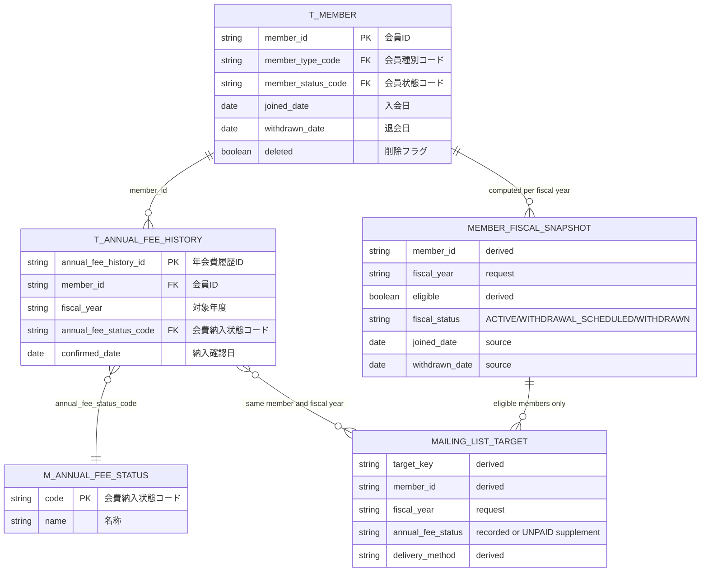
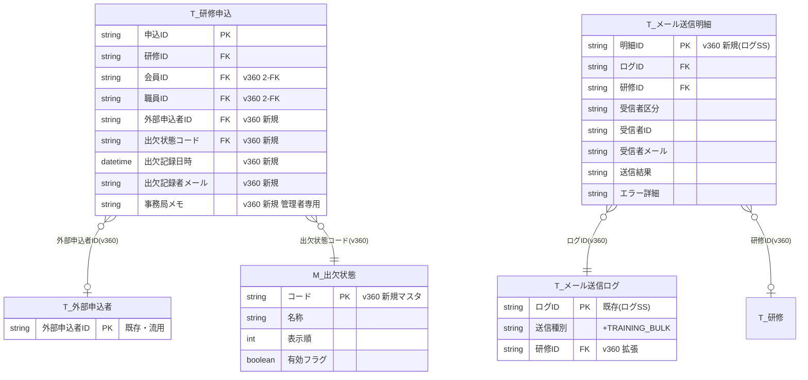

# データモデル設計書（スプレッドシートDB版）

更新日: 2026-07-05
スキーマバージョン: 2026-07-03-cascade-archive-schema-v376.52（**本番 admin @212 デプロイ済**。migrate は次回 admin ログインで自動実行・追加のみ非破壊）

> 下記 ER は `gas-src テーブル定義`（列の正本）＋ `docs/er-metadata.json` から自動生成（AGENTS §4.6）。手書き編集禁止。
> 直近のスキーマ変更: **v376.52** 会員系削除 cascade アーカイブ（`docs/249`・a1 単一化）— `_archive` を 2 本→**13 本**へ拡張（＋認証アカウント/ホワイトリスト/研修申込/年会費納入・更新履歴/役員/振込口座/支払い/支払い明細/請求/変更申請）。サロゲート列を `アーカイブID`/**`削除バッチID`**/`アーカイブ日時` の3列に統一（`削除バッチID`=T_削除ログ.ログID・会員単位復元のバッチキー）。定義は gas-src の `ARCHIVE_SOURCE_TABLES`（単一情報源）からループ生成／**v376.45** `T_LINE投稿依頼` に `作成者名`・`投稿マーク者名` の2列追加／**v376.42-.43** `T_メールテンプレート` 新設＋設定キー追加。
> それ以前: v360 で研修名簿・出欠・一括メール明細ログを追加、v362〜v370 は kana 列・previousYear*・APPLICATION_RECEIPT_* 設定キー追加と bug fix のみ。詳細は §9 スキーマバージョン履歴 / §11 v360 Addendum / §12 v362-v370 Addendum を参照。

---

## 1. 設計方針

- JSON列へ丸ごと保存する方式は採用しない（設定値のみJSON列を例外的に使用する）。
- スプレッドシートを「マスタ」と「トランザクションテーブル」に分割する。
- 1シート1責務、1行1レコード、主キー/外部キー列を明示する。
- 列名・マスタ名・テーブル名はすべて日本語命名とする。

### スプレッドシート構成（v261〜）

| スプレッドシート | 役割 | ID |
|---|---|---|
| **メイン DB** | 会員・研修・認証データ | `1GVlIzOG1Tsqw8fBXgZ__c8u4oMu-4_WCf0H3aVLESKs` |
| **ログ SS** | ログイン履歴・監査ログ・メール送信ログ | `1NmVv483UeehF8dqCdyNKOqOtv_fPKROhHN7011N23lw` |

ログ SS は `getLogSs_()` 経由でアクセスする。`LOG_SPREADSHEET_ID` スクリプトプロパティが未設定の場合はメイン DB にフォールバックする（安全移行）。

---

## 2. Mermaid ER 図

```mermaid
erDiagram
  %% ⚠ AUTO-GENERATED — 手書き禁止。正本は gas-src テーブル定義(列) + docs/er-metadata.json(型/キー/コメント/リレーション)。再生成: npm run build:docs-portal
  %% ===== マスタ =====
  M_会員種別 {
    string コード PK
    string 名称
    int 表示順
    boolean 有効フラグ
    int 年会費金額
  }

  M_会員状態 {
    string コード PK
    string 名称
    int 表示順
    boolean 有効フラグ
  }

  M_発送方法 {
    string コード PK
    string 名称
    int 表示順
    boolean 有効フラグ
  }

  M_郵送先区分 {
    string コード PK
    string 名称
    int 表示順
    boolean 有効フラグ
  }

  M_職員権限 {
    string コード PK
    string 名称
    int 表示順
    boolean 有効フラグ
  }

  M_職員状態 {
    string コード PK
    string 名称
    int 表示順
    boolean 有効フラグ
  }

  M_システムロール {
    string コード PK
    string 名称
    int 表示順
    boolean 有効フラグ
  }

  M_研修状態 {
    string コード PK
    string 名称
    int 表示順
    boolean 有効フラグ
  }

  M_申込状態 {
    string コード PK
    string 名称
    int 表示順
    boolean 有効フラグ
  }

  M_会費納入状態 {
    string コード PK
    string 名称
    int 表示順
    boolean 有効フラグ
  }

  M_申込者区分 {
    string コード PK
    string 名称
    int 表示順
    boolean 削除フラグ
  }

  M_管理者権限 {
    string コード PK
    string 名称
    int 表示順
    boolean 有効フラグ
  }

  M_出欠状態 {
    string コード PK
    string 名称
    int 表示順
    boolean 有効フラグ
  }

  M_組織マスタ {
    string 組織コード PK
    string 組織名
    string 組織種別
    int 表示順
    boolean 全役員表示フラグ
    boolean 有効フラグ
    boolean 削除フラグ
    datetime 作成日時
    datetime 更新日時
  }

  M_役職マスタ {
    string 役職コード PK
    string 役職名
    string 組織コード FK
    boolean 委員長フラグ
    int 表示順
    boolean 有効フラグ
    boolean 削除フラグ
    datetime 作成日時
    datetime 更新日時
  }

  M_支払い種別マスタ {
    string 種別コード PK
    string 種別名
    string 対象区分
    int 表示順
    boolean 有効フラグ
    boolean 削除フラグ
    datetime 作成日時
    datetime 更新日時
  }

  M_業務分類 {
    string 業務分類コード PK
    string 業務分類名
    string 組織コード FK
    int 単価
    int 表示順
    boolean 有効フラグ
    boolean 削除フラグ
    datetime 作成日時
    datetime 更新日時
  }

  %% ===== メインテーブル =====
  T_会員 {
    string 会員ID PK
    string 会員種別コード FK
    string 会員状態コード FK
    date 入会日
    date 退会日
    date 移行日
    date 退会処理日
    string 姓
    string 名
    string セイ
    string メイ
    string 代表メールアドレス
    string 携帯電話番号
    string 勤務先名
    string 勤務先郵便番号
    string 勤務先都道府県
    string 勤務先市区町村
    string 勤務先住所
    string 勤務先住所2
    string 勤務先電話番号
    string 勤務先FAX番号
    string 自宅郵便番号
    string 自宅都道府県
    string 自宅市区町村
    string 自宅住所
    string 自宅住所2
    string 発送方法コード FK
    string 郵送先区分コード FK
    int 職員数上限
    datetime 作成日時
    datetime 更新日時
    boolean 削除フラグ
    string 介護支援専門員番号 "基本8桁数字/admin例外1-10桁英数字 (v372.4)"
    string 事業所番号
    string ステータスメモ
  }

  T_事業所職員 {
    string 職員ID PK
    string 会員ID FK
    string 姓
    string 名
    string セイ
    string メイ
    string 氏名
    string フリガナ
    string メールアドレス
    string 職員権限コード FK
    string 職員状態コード FK
    date 入会日
    date 退会日
    string 介護支援専門員番号 "基本8桁数字/admin例外1-10桁英数字 (v372.4)"
    string メール配信希望コード
    datetime 作成日時
    datetime 更新日時
    boolean 削除フラグ
  }

  T_認証アカウント {
    string 認証ID PK
    string 認証方式
    string ログインID
    string パスワードハッシュ
    string パスワードソルト
    string GoogleユーザーID
    string Googleメール
    string システムロールコード FK
    string 会員ID FK
    string 職員ID FK
    datetime 最終ログイン日時
    datetime パスワード更新日時
    boolean アカウント有効フラグ
    int ログイン失敗回数
    boolean ロック状態
    datetime 作成日時
    datetime 更新日時
    boolean 削除フラグ
  }

  T_管理者Googleホワイトリスト {
    string ホワイトリストID PK
    string Googleメール
    string 紐付け認証ID FK
    string 紐付け会員ID FK
    string 権限コード
    string ロールID
    boolean 有効フラグ
    string 変更者メール
    datetime 変更日時
    datetime 作成日時
    datetime 更新日時
    boolean 削除フラグ
  }

  T_研修 {
    string 研修ID PK
    string 研修名
    date 開催日
    string 開催終了時刻
    int 定員
    int 申込者数
    string 開催場所
    string 研修状態コード FK
    string 主催者
    boolean 法定外研修フラグ
    string 研修概要
    string 研修内容
    string 費用JSON
    date 申込開始日
    date 申込締切日
    string 講師
    string 案内状URL
    string 案内状サムネイルURL
    string 項目設定JSON
    string 登録者メール
    datetime 作成日時
    datetime 更新日時
    boolean 削除フラグ
    string 申込URL
  }

  T_研修申込 {
    string 申込ID PK
    string 研修ID FK
    string 会員ID FK "2-FK v360"
    string 職員ID FK "2-FK v360"
    string 申込状態コード FK
    datetime 申込日時
    datetime 取消日時
    string 備考
    string 申込者区分コード FK "deprecated v360"
    string 申込者ID "deprecated v360"
    datetime 作成日時
    datetime 更新日時
    boolean 削除フラグ
    string 外部申込者ID FK "2-FK v360 新規"
    string 出欠状態コード FK "v360新規"
    datetime 出欠記録日時 "v360新規"
    string 出欠記録者メール "v360新規"
    string 事務局メモ "v360新規 管理者専用"
  }

  T_外部申込者 {
    string 外部申込者ID PK
    string 氏名
    string フリガナ
    string メールアドレス
    string 電話番号
    string 事業所名
    datetime 同意日時
    datetime 作成日時
    datetime 更新日時
    boolean 削除フラグ
  }

  T_年会費納入履歴 {
    string 年会費履歴ID PK
    string 会員ID FK
    string 対象年度
    string 会費納入状態コード FK
    date 納入確認日
    int 金額
    string 備考
    datetime 作成日時
    datetime 更新日時
    boolean 削除フラグ
  }

  T_年会費更新履歴 {
    string 年会費更新履歴ID PK
    string 年会費履歴ID FK
    string 会員ID FK
    string 対象年度
    string 操作種別
    string 更新前JSON
    string 更新後JSON
    string 実行者メール
    datetime 実行日時
  }

  T_役員 {
    string 役員ID PK
    string 会員ID FK
    string 職員ID FK
    string 役職コード FK
    string 組織コード FK
    date 就任日
    date 退任日
    string 備考
    boolean 削除フラグ
    datetime 作成日時
    datetime 更新日時
  }

  T_振込口座 {
    string 口座ID PK
    string 会員ID FK
    string 職員ID FK
    string 金融機関名
    string 金融機関コード
    string 支店名
    string 支店コード
    string 口座種別
    string 口座番号
    string 口座名義カナ
    string 備考
    boolean 削除フラグ
    datetime 作成日時
    datetime 更新日時
  }

  T_支払い {
    string 支払いID PK
    string 会員ID FK
    date 支払い日
    string 支払い方法
    int 合計金額
    string 振込先口座JSON
    string 登録者メール
    string 備考
    boolean 削除フラグ
    datetime 作成日時
    datetime 更新日時
  }

  T_支払い明細 {
    string 明細ID PK
    string 支払いID FK
    string 請求ID FK
    string 役職コード FK
    string 組織コード FK
    string 種別コード FK
    int 金額
    date 対象期間FROM
    date 対象期間TO
    string 摘要
    boolean 削除フラグ
    datetime 作成日時
    datetime 更新日時
  }

  T_請求 {
    string 請求ID PK
    string 会員ID FK
    string 職員ID FK
    string 役職コード FK
    string 組織コード FK
    string 種別コード FK
    string 請求種別
    string 業務分類コード FK
    int 単価
    int 数量
    int 請求金額
    date 活動日
    string 活動内容
    string 添付ファイルURL
    string 請求状態
    string 却下理由
    string 承認者メール
    datetime 承認日時
    boolean 削除フラグ
    datetime 作成日時
    datetime 更新日時
  }

  T_システム設定 {
    string 設定キー PK
    string 設定値
    string 説明
    datetime 更新日時
  }

  T_共有メモ {
    string キー PK
    string 内容
    string 更新者メール
    string 更新者名
    datetime 更新日時
    int バージョン
  }

  T_画面項目権限 {
    string 権限定義ID PK
    string システムロールコード FK
    string 画面コード
    string 項目コード
    boolean 閲覧可
    boolean 登録可
    boolean 変更可
    boolean 削除可
    datetime 作成日時
    datetime 更新日時
    boolean 削除フラグ
  }

  %% ===== アーカイブシート（メインDB内・削除cascade退避先。元テーブルと同スキーマ + サロゲート3列。docs/249） =====
  T_会員_archive {
    string 会員ID
    string 会員種別コード
    string 会員状態コード
    date 入会日
    date 退会日
    date 移行日
    date 退会処理日
    string 姓
    string 名
    string セイ
    string メイ
    string 代表メールアドレス
    string 携帯電話番号
    string 勤務先名
    string 勤務先郵便番号
    string 勤務先都道府県
    string 勤務先市区町村
    string 勤務先住所
    string 勤務先住所2
    string 勤務先電話番号
    string 勤務先FAX番号
    string 自宅郵便番号
    string 自宅都道府県
    string 自宅市区町村
    string 自宅住所
    string 自宅住所2
    string 発送方法コード
    string 郵送先区分コード
    int 職員数上限
    datetime 作成日時
    datetime 更新日時
    boolean 削除フラグ
    string 介護支援専門員番号 "基本8桁数字/admin例外1-10桁英数字 (v372.4)"
    string 事業所番号
    string ステータスメモ
    string アーカイブID PK "行個別の一意キー(UUID)"
    string 削除バッチID FK "T_削除ログ.ログID。会員単位復元のバッチキー(docs/249)"
    datetime アーカイブ日時
  }

  T_事業所職員_archive {
    string 職員ID
    string 会員ID
    string 姓
    string 名
    string セイ
    string メイ
    string 氏名
    string フリガナ
    string メールアドレス
    string 職員権限コード
    string 職員状態コード
    date 入会日
    date 退会日
    string 介護支援専門員番号 "基本8桁数字/admin例外1-10桁英数字 (v372.4)"
    string メール配信希望コード
    datetime 作成日時
    datetime 更新日時
    boolean 削除フラグ
    string アーカイブID PK "行個別の一意キー(UUID)"
    string 削除バッチID FK "T_削除ログ.ログID。会員単位復元のバッチキー(docs/249)"
    datetime アーカイブ日時
  }

  T_認証アカウント_archive {
    string 認証ID
    string 認証方式
    string ログインID
    string パスワードハッシュ
    string パスワードソルト
    string GoogleユーザーID
    string Googleメール
    string システムロールコード
    string 会員ID
    string 職員ID
    datetime 最終ログイン日時
    datetime パスワード更新日時
    boolean アカウント有効フラグ
    int ログイン失敗回数
    boolean ロック状態
    datetime 作成日時
    datetime 更新日時
    boolean 削除フラグ
    string アーカイブID PK "行個別の一意キー(UUID)"
    string 削除バッチID FK "T_削除ログ.ログID。会員単位復元のバッチキー(docs/249)"
    datetime アーカイブ日時
  }

  T_管理者Googleホワイトリスト_archive {
    string ホワイトリストID
    string Googleメール
    string 紐付け認証ID
    string 紐付け会員ID
    string 権限コード
    string ロールID
    boolean 有効フラグ
    string 変更者メール
    datetime 変更日時
    datetime 作成日時
    datetime 更新日時
    boolean 削除フラグ
    string アーカイブID PK "行個別の一意キー(UUID)"
    string 削除バッチID FK "T_削除ログ.ログID。会員単位復元のバッチキー(docs/249)"
    datetime アーカイブ日時
  }

  T_研修申込_archive {
    string 申込ID
    string 研修ID
    string 会員ID "2-FK v360"
    string 職員ID "2-FK v360"
    string 申込状態コード
    datetime 申込日時
    datetime 取消日時
    string 備考
    string 申込者区分コード "deprecated v360"
    string 申込者ID "deprecated v360"
    datetime 作成日時
    datetime 更新日時
    boolean 削除フラグ
    string 外部申込者ID "2-FK v360 新規"
    string 出欠状態コード "v360新規"
    datetime 出欠記録日時 "v360新規"
    string 出欠記録者メール "v360新規"
    string 事務局メモ "v360新規 管理者専用"
    string アーカイブID PK "行個別の一意キー(UUID)"
    string 削除バッチID FK "T_削除ログ.ログID。会員単位復元のバッチキー(docs/249)"
    datetime アーカイブ日時
  }

  T_年会費納入履歴_archive {
    string 年会費履歴ID
    string 会員ID
    string 対象年度
    string 会費納入状態コード
    date 納入確認日
    int 金額
    string 備考
    datetime 作成日時
    datetime 更新日時
    boolean 削除フラグ
    string アーカイブID PK "行個別の一意キー(UUID)"
    string 削除バッチID FK "T_削除ログ.ログID。会員単位復元のバッチキー(docs/249)"
    datetime アーカイブ日時
  }

  T_年会費更新履歴_archive {
    string 年会費更新履歴ID
    string 年会費履歴ID
    string 会員ID
    string 対象年度
    string 操作種別
    string 更新前JSON
    string 更新後JSON
    string 実行者メール
    datetime 実行日時
    string アーカイブID PK "行個別の一意キー(UUID)"
    string 削除バッチID FK "T_削除ログ.ログID。会員単位復元のバッチキー(docs/249)"
    datetime アーカイブ日時
  }

  T_役員_archive {
    string 役員ID
    string 会員ID
    string 職員ID
    string 役職コード
    string 組織コード
    date 就任日
    date 退任日
    string 備考
    boolean 削除フラグ
    datetime 作成日時
    datetime 更新日時
    string アーカイブID PK "行個別の一意キー(UUID)"
    string 削除バッチID FK "T_削除ログ.ログID。会員単位復元のバッチキー(docs/249)"
    datetime アーカイブ日時
  }

  T_振込口座_archive {
    string 口座ID
    string 会員ID
    string 職員ID
    string 金融機関名
    string 金融機関コード
    string 支店名
    string 支店コード
    string 口座種別
    string 口座番号
    string 口座名義カナ
    string 備考
    boolean 削除フラグ
    datetime 作成日時
    datetime 更新日時
    string アーカイブID PK "行個別の一意キー(UUID)"
    string 削除バッチID FK "T_削除ログ.ログID。会員単位復元のバッチキー(docs/249)"
    datetime アーカイブ日時
  }

  T_支払い_archive {
    string 支払いID
    string 会員ID
    date 支払い日
    string 支払い方法
    int 合計金額
    string 振込先口座JSON
    string 登録者メール
    string 備考
    boolean 削除フラグ
    datetime 作成日時
    datetime 更新日時
    string アーカイブID PK "行個別の一意キー(UUID)"
    string 削除バッチID FK "T_削除ログ.ログID。会員単位復元のバッチキー(docs/249)"
    datetime アーカイブ日時
  }

  T_支払い明細_archive {
    string 明細ID
    string 支払いID
    string 請求ID
    string 役職コード
    string 組織コード
    string 種別コード
    int 金額
    date 対象期間FROM
    date 対象期間TO
    string 摘要
    boolean 削除フラグ
    datetime 作成日時
    datetime 更新日時
    string アーカイブID PK "行個別の一意キー(UUID)"
    string 削除バッチID FK "T_削除ログ.ログID。会員単位復元のバッチキー(docs/249)"
    datetime アーカイブ日時
  }

  T_請求_archive {
    string 請求ID
    string 会員ID
    string 職員ID
    string 役職コード
    string 組織コード
    string 種別コード
    string 請求種別
    string 業務分類コード
    int 単価
    int 数量
    int 請求金額
    date 活動日
    string 活動内容
    string 添付ファイルURL
    string 請求状態
    string 却下理由
    string 承認者メール
    datetime 承認日時
    boolean 削除フラグ
    datetime 作成日時
    datetime 更新日時
    string アーカイブID PK "行個別の一意キー(UUID)"
    string 削除バッチID FK "T_削除ログ.ログID。会員単位復元のバッチキー(docs/249)"
    datetime アーカイブ日時
  }

  T_変更申請_archive {
    string 申請ID
    string 会員ID
    string 会員種別コード
    string 申請種別コード
    string 申請状態コード
    string 申請内容JSON
    string 連絡先メールアドレス
    string 申請者表示名
    datetime 申請日時
    datetime 処理日時
    string 処理者メールアドレス
    string 処理備考
    datetime 作成日時
    datetime 更新日時
    boolean 削除フラグ
    string アーカイブID PK "行個別の一意キー(UUID)"
    string 削除バッチID FK "T_削除ログ.ログID。会員単位復元のバッチキー(docs/249)"
    datetime アーカイブ日時
  }

  %% ===== ログSS（別スプレッドシート） =====
  T_ログイン履歴 {
    string ログイン履歴ID PK
    string 認証ID FK
    string ログインID
    string 認証方式
    string ログイン結果
    string 失敗理由
    string 接続元IP
    string ユーザーエージェント
    datetime 実行日時
  }

  T_監査ログ {
    string 監査ログID PK
    datetime 操作日時
    string 操作者メール
    string 操作種別
    string 対象テーブル
    string 対象レコードID
    string フィールド名
    string 旧値
    string 新値
  }

  T_メール送信ログ {
    string ログID PK
    datetime 送信日時
    string 送信者メール
    string 件名テンプレート
    int 宛先数
    int 成功数
    int エラー数
    string 送信種別
    string 研修ID FK "v360拡張 nullable"
    boolean 削除フラグ
  }

  T_メール送信明細 {
    string 明細ID PK
    string ログID FK
    string 研修ID FK "nullable"
    string 受信者区分 "MEMBER/STAFF/EXTERNAL"
    string 受信者ID "ポリモーフィック: 会員ID/職員ID/外部申込者ID"
    string 受信者メール
    string 送信結果 "SENT/FAILED"
    string エラー詳細
    datetime 作成日時
    boolean 削除フラグ
  }

  %% ===== その他 =====
  T_権限ロール {
    string ロールID PK
    string ロール名
    string 説明
    string 許可メニューJSON
    string 研修編集スコープ
    boolean 組込フラグ
    boolean マスターフラグ
    int 表示順
    datetime 作成日時
    datetime 更新日時
    boolean 削除フラグ
  }

  T_メールテンプレート {
    string テンプレートID PK "UUID"
    string カテゴリ "CREDENTIAL/BIZ_REP/... メール種別"
    string 名前 "テンプレート名"
    string 件名
    string 本文 "{{タグ}} 差し込み対応"
    boolean 既定フラグ "将来用"
    datetime 作成日時
    datetime 更新日時
    boolean 削除フラグ
  }

  T_削除ログ {
    string ログID PK
    datetime 操作日時
    string 操作者メール
    string 対象会員IDリスト
    string 削除前スナップショットJSON
  }

  T_変更申請 {
    string 申請ID PK
    string 会員ID
    string 会員種別コード
    string 申請種別コード
    string 申請状態コード
    string 申請内容JSON
    string 連絡先メールアドレス
    string 申請者表示名
    datetime 申請日時
    datetime 処理日時
    string 処理者メールアドレス
    string 処理備考
    datetime 作成日時
    datetime 更新日時
    boolean 削除フラグ
  }

  T_人物統合ログ {
    string ログID PK
    string 処理種別
    string 介護支援専門員番号
    string 旧会員ID
    string 旧職員ID
    string 新会員ID
    string 新職員ID
    string 結果コード
    string 詳細JSON
    string 実行者メール
    datetime 実行日時
    datetime 作成日時
    boolean 削除フラグ
  }

  T_LINE投稿依頼 {
    string 投稿依頼ID PK
    string ステータス
    string テキスト
    string 研修申込リンク
    string 添付ファイルURL
    string 添付ファイル種別
    string 添付ファイル名
    string 対象種別
    string 対象ID
    string 作成者メール
    datetime 作成日時
    datetime 更新日時
    datetime 投稿依頼日時
    datetime 投稿日時
    string 投稿マーク者メール
    string 備考
    boolean 削除フラグ
    string 作成者名 "依頼者表示名（v376.45）"
    string 投稿マーク者名 "投稿者表示名（v376.45）"
  }

  T_規程 {
    string 規程ID PK "REG-001 形式"
    string 区分コード "NOTICE=重要事項 / REGULATION=規程・定款"
    string タイトル
    string 本文 "20,000 文字以内"
    string 外部リンクURL "https:// のみ"
    string 外部リンク文言
    string 対象会員種別 FK "ALL または M_会員種別.コード"
    int 版数 "本文・タイトル・リンク変更時に +1（Phase 2 の同意記録が指す版）"
    date 施行日
    int 表示順
    boolean 公開フラグ "公開ポータルに出すか"
    string 更新者メール
    boolean 削除フラグ "soft delete"
    datetime 作成日時
    datetime 更新日時
  }

  T_会員 }o--|| M_会員種別 : "会員種別コード"
  T_会員 }o--|| M_会員状態 : "会員状態コード"
  T_会員 }o--o| M_発送方法 : "発送方法コード"
  T_会員 }o--o| M_郵送先区分 : "郵送先区分コード"
  T_事業所職員 }o--|| T_会員 : "会員ID"
  T_事業所職員 }o--|| M_職員権限 : "職員権限コード"
  T_事業所職員 }o--|| M_職員状態 : "職員状態コード"
  T_認証アカウント }o--|| T_会員 : "会員ID"
  T_認証アカウント }o--o| T_事業所職員 : "職員ID"
  T_認証アカウント }o--|| M_システムロール : "システムロールコード"
  T_管理者Googleホワイトリスト }o--o| T_認証アカウント : "紐付け認証ID"
  T_管理者Googleホワイトリスト }o--o| T_会員 : "紐付け会員ID"
  T_研修申込 }o--|| T_研修 : "研修ID"
  T_研修申込 }o--o| T_会員 : "会員ID(v360 2-FK)"
  T_研修申込 }o--o| T_事業所職員 : "職員ID(v360 2-FK)"
  T_研修申込 }o--o| T_外部申込者 : "外部申込者ID(v360 2-FK 新規)"
  T_研修申込 }o--|| M_出欠状態 : "出欠状態コード(v360新規)"
  T_研修申込 }o--|| M_申込者区分 : "申込者区分コード(deprecated v360)"
  T_研修申込 }o--o| M_申込状態 : "申込状態コード"
  T_メール送信明細 }o--|| T_メール送信ログ : "ログID(v360新規)"
  T_メール送信明細 }o--o| T_研修 : "研修ID(v360新規)"
  T_研修 }o--|| M_研修状態 : "研修状態コード"
  T_年会費納入履歴 }o--|| T_会員 : "会員ID"
  T_年会費納入履歴 }o--|| M_会費納入状態 : "会費納入状態コード"
  T_年会費更新履歴 }o--|| T_年会費納入履歴 : "年会費履歴ID"
  T_年会費更新履歴 }o--|| T_会員 : "会員ID"
  M_役職マスタ }o--|| M_組織マスタ : "組織コード"
  M_業務分類 }o--|| M_組織マスタ : "組織コード"
  T_役員 }o--o| T_会員 : "会員ID"
  T_役員 }o--o| T_事業所職員 : "職員ID"
  T_役員 }o--|| M_役職マスタ : "役職コード"
  T_役員 }o--|| M_組織マスタ : "組織コード"
  T_振込口座 }o--o| T_会員 : "会員ID"
  T_振込口座 }o--o| T_事業所職員 : "職員ID"
  T_支払い }o--|| T_会員 : "会員ID"
  T_支払い明細 }o--|| T_支払い : "支払いID"
  T_支払い明細 }o--o| T_請求 : "請求ID"
  T_支払い明細 }o--|| M_役職マスタ : "役職コード"
  T_支払い明細 }o--|| M_組織マスタ : "組織コード"
  T_支払い明細 }o--|| M_支払い種別マスタ : "種別コード"
  T_請求 }o--o| T_会員 : "会員ID"
  T_請求 }o--o| T_事業所職員 : "職員ID"
  T_請求 }o--|| M_役職マスタ : "役職コード"
  T_請求 }o--|| M_組織マスタ : "組織コード"
  T_請求 }o--|| M_支払い種別マスタ : "種別コード"
  T_請求 }o--o| M_業務分類 : "業務分類コード"
  T_画面項目権限 }o--|| M_システムロール : "システムロールコード"
  T_ログイン履歴 }o--o| T_認証アカウント : "認証ID"
  T_会員_archive }o--o| T_削除ログ : "削除バッチID"
  T_事業所職員_archive }o--o| T_削除ログ : "削除バッチID"
  T_認証アカウント_archive }o--o| T_削除ログ : "削除バッチID"
  T_管理者Googleホワイトリスト_archive }o--o| T_削除ログ : "削除バッチID"
  T_研修申込_archive }o--o| T_削除ログ : "削除バッチID"
  T_年会費納入履歴_archive }o--o| T_削除ログ : "削除バッチID"
  T_年会費更新履歴_archive }o--o| T_削除ログ : "削除バッチID"
  T_役員_archive }o--o| T_削除ログ : "削除バッチID"
  T_振込口座_archive }o--o| T_削除ログ : "削除バッチID"
  T_支払い_archive }o--o| T_削除ログ : "削除バッチID"
  T_支払い明細_archive }o--o| T_削除ログ : "削除バッチID"
  T_請求_archive }o--o| T_削除ログ : "削除バッチID"
  T_変更申請_archive }o--o| T_削除ログ : "削除バッチID"
  T_規程 }o--o| M_会員種別 : "対象会員種別"
```

---

## 3. マスタ一覧

### 3.1 `M_会員種別`
- 用途: 会員の区分管理
- 列: `コード`, `名称`, `表示順`, `有効フラグ`, `年会費金額`
- 初期値（v376.64〜 は**未設定のときだけ補完**し、設定済みの金額は初期化で上書きしない）:
  - `INDIVIDUAL`（個人会員, 3,000円）
  - `BUSINESS`（事業所会員, 8,000円）
  - `SUPPORT`（賛助会員, 5,000円）
- `年会費金額` は**年会費の唯一の正本**。管理画面 設定 → 会費設定 から変更でき、
  公開ポータルの入会申込カード表示・年会費請求・メール差し込みがすべてこの列を読む
  （`readMemberTypeAnnualFees_` / `getAnnualFeeAmountMap_`）。
- 関連する `T_システム設定` キー: `MEMBERSHIP_FEE_PUBLIC_VISIBLE`（入会申込画面に年会費を出すか）、
  `MEMBERSHIP_FEE_NOTE`（同画面に添える補足・200 文字以内）。**金額はここに二重で持たない**。

### 3.2 `M_会員状態`
- 用途: 会員状態の管理
- 列: `コード`, `名称`, `表示順`, `有効フラグ`
- 初期値: `ACTIVE`（有効）, `WITHDRAWAL_SCHEDULED`（退会予定）, `WITHDRAWN`（退会）, `TRANSFERRED`（移行済み）

### 3.3 `M_発送方法`
- 用途: 通知媒体（メール/郵送）
- 列: `コード`, `名称`, `表示順`, `有効フラグ`

### 3.4 `M_郵送先区分`
- 用途: 定期郵送先（自宅/勤務先）
- 列: `コード`, `名称`, `表示順`, `有効フラグ`

### 3.5 `M_職員権限`
- 用途: 事業所職員の権限（3階層）
- 初期値:
  - `REPRESENTATIVE`（代表者）: 職員の追加・削除、代表者変更が可能
  - `ADMIN`（管理者）: 職員の追加・削除が可能（代表者の変更は不可）
  - `STAFF`（一般）: 自分の情報のみ閲覧・編集可能

### 3.6 `M_職員状態`
- 用途: 在籍/退職
- 列: `コード`, `名称`, `表示順`, `有効フラグ`

### 3.7 `M_システムロール`
- 用途: ログイン主体ごとのシステム権限
- 初期値: `OFFICE_ADMIN`, `INDIVIDUAL_MEMBER`, `BUSINESS_ADMIN`, `BUSINESS_MEMBER`

### 3.8 `M_研修状態`
- 用途: 研修レコード自体のライフサイクル状態を表す。申込可否は `申込開始日` / `申込締切日` / `開催日` / `定員` / `申込者数` から API 層で導出する。
- 初期値: `DRAFT`（下書き）, `PUBLISHED`（公開）, `CANCELLED`（中止）, `ARCHIVED`（アーカイブ）
- 後方互換: 旧値 `OPEN` / `CLOSED` は既存データ読み取り時に `PUBLISHED` とみなし、申込可否は導出値 `applicationStatus` / `isApplicationOpen` を正とする。

### 3.9 `M_申込状態`
- 用途: 申込状態（申込済/取消）

### 3.10 `M_会費納入状態`
- 用途: 年会費の納入状態

### 3.11 `M_申込者区分`
- 用途: 研修申込者が会員か非会員かを区別
- 初期値: `MEMBER`（会員）, `EXTERNAL`（非会員）

### 3.12 `M_管理者権限`
- 用途: 管理画面の権限レベル管理

### 3.13 `M_組織マスタ` / `M_役職マスタ` / `M_支払い種別マスタ` — v295追加

- 用途: 役員管理、支払い、請求の分類マスタ。
- `M_組織マスタ`: 本部、理事会、監事会、事務局、各委員会などの組織定義。
- `M_役職マスタ`: 会長、副会長、理事、監事、委員長、委員などの役職定義。`組織コード` で組織に属する。
- `M_支払い種別マスタ`: 役員報酬、活動費、謝礼、交通費、消耗品費、その他などの支払い・請求種別。
- 管理者ポータルのシステム設定マスタ管理から CRUD 可能。ただし参照中のマスタ削除はバックエンドで拒否する。

### 3.14 `M_出欠状態` — v360 追加

- 用途: 研修申込者の当日出欠状態を表す。`T_研修申込.出欠状態コード` から参照される。
- 列: `コード`, `名称`, `表示順`, `有効フラグ`
- 初期値:
  - `UNRECORDED`（未記録）— 既定値。出欠記録前のすべての行に適用。
  - `PRESENT`（出席）
  - `ABSENT`（欠席）
  - `LATE`（遅刻）
  - `SAMEDAY_CANCEL`（当日キャンセル）
- 拡張性: 将来 `EARLY_LEAVE`（早退）/`ONLINE`（オンライン参加）等を追加可能。enum 直書きを避けマスタ化することで破壊変更を伴わない。
- 削除制約: 既存 `T_研修申込` から参照中のコードはマスタ管理 UI 上で削除不可とする（既存マスタ `M_組織マスタ` 等と同パターン）。

### 3.15 `M_業務分類` — v333 追加

- 用途: 役員の活動報告で選択する業務内容と単価を管理する。
- `組織コード`: 活動部（組織）に紐づく。会員側では、選択した活動部に属する有効な業務分類だけを表示する。
- `単価`: 活動報告の請求金額として自動適用される。数量は常に 1。
- 管理者ポータルの役員マスタ設定から CRUD 可能。ただし既存請求で使用中の業務分類は削除不可。

---

## 4. テーブル詳細

### 4.1 `T_会員` — メインDB

主キー: `会員ID`

| フィールド | 個人会員 | 事業所会員 | 賛助会員 |
|---|---|---|---|
| 姓/名/セイ/メイ | 必須 | ブランク | 必須 |
| 介護支援専門員番号 | 必須（基本: 8桁半角数字 / **admin 例外**: 1〜10桁半角英数字） | ブランク | 任意 |
| 勤務先名〜住所2 | 郵送先=OFFICE時は名前必須、住所2任意 | 基本情報として使用 | 同左 |
| 自宅住所系 | 郵送先=HOME時に使用 | 使用しない | 郵送先=HOME時に使用 |
| 発送方法/郵送先区分 | 使用 | ブランク | 使用 |
| 事業所番号 | 使用しない | 必須（半角英数字10文字） | 使用しない |

- `退会処理日`：退会手続き実施日。`退会日` は年度末 3/31 を自動計算。
- `移行日`：同一人物が別会員種別・別事業所職員レコードへ移行した日。`会員状態コード=TRANSFERRED` の場合に記録する。
- **介護支援専門員番号バリデーション規約（v372.4〜）**：
  - **基本ルール**: 8 桁の半角数字（公開ポータルの入会申請・会員情報変更・退会申請、会員マイページの編集すべてで強制）
  - **admin 例外（MASTER/ADMIN 権限のみ）**: 1〜10 桁の半角英数字（A-Z/a-z/0-9）を許容
    - 例: 看護師・保健師等 = `HN` + 事業所番号下 8 桁、社会福祉士 = `HS` + 事業所番号下 8 桁
    - 目的: 地域包括支援センターに所属する介護支援専門員以外（看護師・社会福祉士等）の例外登録
    - 適用画面: 会員詳細編集（`MemberDetailAdmin`）・事業所職員詳細編集（`StaffDetailAdmin`）のみ
  - **DB 保存時の正規化**: 半角英数字を大文字統一（`hn` → `HN`）。`normalizeCmNumberForKey_` で重複チェック・突合
  - **既存データ互換**: 純 8 桁数字レコードは正規化後も同値（toUpperCase が数字に影響なし）
- `ステータスメモ`：管理者コンソール専用の会員状態メモ。退会処理・退会予定・移行済み等の補足を最大 2,000 文字で記録する。会員マイページ・公開ポータルには出力しない。
- `勤務先住所2` / `自宅住所2`：建物名・部屋番号（任意）。v261 で入会申込フォームに追加。
- `事業所番号` による二重登録防止（公開ポータル申込時）。

### 4.2 `T_事業所職員` — メインDB

外部キー: `会員ID` → `T_会員`

- `職員権限コード='REPRESENTATIVE'` の行が事業所代表者情報の正本。
- `姓`/`名`/`セイ`/`メイ` が構造化列の正本。`氏名`/`フリガナ` は表示用スナップショット。
- `メール配信希望コード`（YES/NO）: 特定電子メール法オプトイン準拠。

### 4.3 `T_認証アカウント` — メインDB

- 会員ログイン: `認証方式='PASSWORD'` / `ログインID + ハッシュ+ソルト`
- 管理者ログイン: `認証方式='GOOGLE'` / `Session.getActiveUser()` + ホワイトリスト照合
- パスワード平文は保存しない。
- v118 以降 GoogleユーザーID（sub）照合は廃止。Googleメールで照合。

### 4.4 `T_管理者Googleホワイトリスト` — メインDB

- 追加・更新・削除時は `admin_wl_v1` / `admin_auth_v1` キャッシュを即時無効化。
- 紐付け不整合（WLの会員IDと認証アカウントの会員IDが不一致）はログイン拒否。

### 4.5 `T_研修` — メインDB

#### `費用JSON` スキーマ
```json
[{ "label": "会員", "amount": 0 }, { "label": "非会員", "amount": 1000 }]
```

#### `項目設定JSON` スキーマ
```json
{
  "fieldConfig": {
    "organizer": true, "isNonMandatory": true, "summary": true, "description": true,
    "location": true, "instructor": true, "applicationOpenDate": true,
    "applicationCloseDate": true, "fees": true, "guidePdfUrl": true, "applicationUrl": true
  },
  "cancelAllowed": true,
  "inquiryPerson": "事務局 田中",
  "inquiryContactType": "EMAIL",
  "inquiryContactValue": "support@example.com",
  "inquiryPhone": "072-000-0000",
  "inquiryEmail": "support@example.com"
}
```

- `fieldConfig` は研修の任意項目トグル（admin 研修管理の「有効/無効」スイッチ）。`true`=有効、`false`=無効。**キー欠落・旧データはデフォルト有効**（`isTrainingFieldEnabled` が `!== false` 判定）。
- **公開表示への影響（v376.34〜）**: `fieldConfig` は admin 編集フォームだけでなく**公開ポータルの申込画面**の単一情報源。無効の情報項目（講師 / 案内PDF / 申込締切 / 詳細内容 / 費用）は公開ポータルに表示されない。
- **`applicationUrl` の特別な意味（v376.35〜）**: 公開ポータルの申込 CTA を 3 状態で制御する（`resolveApplyCta`）。
  - 有効 ＋ `申込URL` 列に値あり → 「申込フォームへ」外部リンク
  - 有効 ＋ `申込URL` 列が空 → 「＋申し込む」内部申込フォーム
  - **無効** → **申込ボタンを表示しない（公開での申込受付 OFF・閲覧のみ）**
- `inquiryPhone` / `inquiryEmail` は v265〜の事業所メール設定差し込み等で参照。`inquiryContactType`/`Value` はプライマリ問合せ先（後方互換）。

### 4.6 `T_研修申込` — メインDB

#### 人物識別モデル（v360 で 2-FK 化）

v360 以降、研修申込者の識別は **3 つの独立した FK 列の XOR 制約**を正本とする（2026 年データベース設計ベストプラクティスに準拠）。

| 申込者種別 | `会員ID` | `職員ID` | `外部申込者ID` |
|---|---|---|---|
| 個人会員 / 賛助会員 | non-empty | empty | empty |
| 事業所職員 | empty | non-empty | empty |
| 非会員（公開ポータル経由） | empty | empty | non-empty |

- 3 列のうち**ちょうど 1 つ**が non-empty。それ以外の状態は API 層で拒否する。
- 旧 `申込者区分コード` / `申込者ID` は **deprecated**。物理列は v360 では削除しないが、新規書込みは行わず、読み取り時のみ FK 列から派生して後方互換を提供する。v361 以降の release で物理削除を計画する。
- 整合性監査関数 `getTrainingApplicationIntegrityIssues_` は 2-FK 規約へ書換える。
- マイグレーション関数 `migrateTrainingApplicationsToTwoFkForV360_` は既存行を読み取り、申込者区分 `EXTERNAL` の行を `外部申込者ID` 列へ移送する。

#### 出欠管理列（v360 新規）

| 列 | 型 | NULL | FK | 用途 |
|---|---|---|---|---|
| `出欠状態コード` | string | NOT NULL（既定値 `UNRECORDED`） | M_出欠状態 | 当日出欠の記録 |
| `出欠記録日時` | datetime ISO | NULL | - | 監査用 |
| `出欠記録者メール` | string | NULL | (T_管理者WL論理参照) | スナップショット保存。WL 削除後も残存 |
| `事務局メモ` | string(max 1000) | NULL | - | 管理者専用フリーテキスト。**会員側 API には絶対に出力しない** |

- 出欠は 1 申込 = 1 出欠の **1:1 関係**のため別テーブル化せず T_研修申込 列追加で表現（JOIN コスト回避、3NF 準拠：全列が `申込ID` にのみ依存）。
- 出欠履歴（複数回記録）の必要性は現要件にないが、将来発生した場合は `T_研修出欠履歴` を別途追加し、本表は最新値スナップショットとして維持する。

### 4.7 `T_外部申込者` — メインDB

- 収集目的: 研修申込の受付・確認連絡のみ（個人情報保護法対応）。
- 保管期間: 研修終了日の翌年4月1日まで（`削除フラグ` で管理）。

### 4.8 `T_年会費納入履歴` / `T_年会費更新履歴` — メインDB

- `会員ID + 対象年度` の組合わせは重複不可。
- `PAID` の場合 `納入確認日` 必須。
- 更新ごとに `T_年会費更新履歴` に差分を記録（監査ログ兼用）。

### 4.9 `T_システム設定` — メインDB

主キー: `設定キー`。代表的なキー：

**メール送信設定（既存 + v371 / v372 系で拡張）**:
- 既存カテゴリ（v265 / v368）:
  - `CREDENTIAL_EMAIL_ENABLED` / `_FROM` / `_SUBJECT` / `_BODY` — 入会時認証情報メール
  - `BIZ_REP_EMAIL_*` / `BIZ_STAFF_EMAIL_*` — 事業所入会時メール
  - `STAFF_ADD_REP_EMAIL_*` / `STAFF_ADD_STAFF_EMAIL_*` — 職員追加承認メール
  - `IND_SUPP_EMAIL_ENABLED` — 個人・賛助会員入会メール
  - `APPLICATION_RECEIPT_*` / `APPROVAL_NOTIFICATION_*` / `REJECTION_NOTIFICATION_*` — 変更申請ワークフローメール
- **v371.x 4 階層ガード**:
  - `MAIL_GLOBAL_ENABLED` — 全停止スイッチ（initial=false で safe-stop）
  - `MAIL_DELIVERY_MODE` — `LIVE` / `REDIRECT` / `SUPPRESS`
  - `MAIL_REDIRECT_ALLOWLIST` — REDIRECT モード時の宛先（カンマ区切り）
  - 補完カテゴリ ENABLED: `TRAINING_APPLY_RECEIPT_ENABLED` / `TRAINING_REMINDER_ENABLED` / `BULK_MAIL_ENABLED` / `AUTH_OTP_ENABLED` / `MEMBER_UPDATE_CONFIRM_ENABLED` / `WITHDRAWAL_CONFIRM_ENABLED` / `PASSWORD_RESET_ENABLED`
  - 詳細設計: `docs/227_MAIL_KILL_SWITCH_2026-05-18.md`

**公開ポータル設定**:
- `PUBLIC_PORTAL_*`（公開ポータル各カードの表示設定）

**年会費・名簿**:
- `ANNUAL_FEE_TRANSFER_ACCOUNT`
- `ROSTER_TEMPLATE_LIST`（v316〜・legacy・S5 で削除予定）
- `ROSTER_TEMPLATE_LIBRARY_V2`（v372〜・Visual Designer 用 JSON 配列）

**運用パラメータ**:
- `DEFAULT_BUSINESS_STAFF_LIMIT` / `TRAINING_HISTORY_LOOKBACK_MONTHS`
- `TRAINING_FILE_FOLDER_ID` / `CLAIM_ATTACHMENT_FOLDER_ID`
- `BULK_MAIL_AUTO_ATTACH_FOLDER_ID` / `EMAIL_LOG_VIEWER_ROLE`（MASTER 限定）

### 4.10 `T_会員_archive` / `T_事業所職員_archive` — メインDB（v261追加 / v376.36 改訂）

同一スプレッドシート内の別シート。スキーマは元テーブル + サロゲート列（`アーカイブID` / `アーカイブ日時`）。

#### 設計モデル: 「移動（move）」であって追記履歴ではない
退会会員の扱いは **2 段階**:

| 段階 | 操作 | 元テーブル(T_会員) | archive |
|---|---|---|---|
| 退会時 | **ソフト削除**（`削除フラグ=true`・退会日記録） | 残る（退会日まで利用可・復元可） | 無し |
| 退会から3年超 | `moveWithdrawnRowsToArchive_` が archive へ追記 ＋ **元テーブルから物理削除** | **物理削除（行除去）** | 1 行 |

→ ある `会員ID`/`職員ID` は **元テーブルと archive のどちらか片方にのみ存在**する（移動のため）。したがって自然キー（会員ID）でも重複しない。**追記履歴モデルなら同一 ID が複数行になり自然キーは PK になり得ない**が、本設計は move なのでその問題は起きない。

#### 主キー（v376.36〜）
- **`アーカイブID`（surrogate, `ARC-` + UUID12）を主キー**とする。`会員ID`/`職員ID` は業務キー（移動モデル上は一意だが、Spreadsheet は一意制約を強制できないためサロゲートを併設）。
- `アーカイブ日時`（ISO）でいつ移動したかを記録。
- `moveWithdrawnRowsToArchive_` は **冪等**: 既に archive 済みの key は二重追記せず元テーブルから除去（前回ジョブの部分失敗からの自己修復）。archive 追記を先に行い成功後に元テーブルを削除（データ消失防止）。

#### ⚠️ 現在の稼働状態（重要）
- **`runArchiveOldWithdrawnMembers()` / `moveWithdrawnRowsToArchive_` は build pruner により全 split の生成物から除外されている（dead code）。** したがって**移動ジョブは本番で一度も実行されず、archive シートは常に空**である（シート定義と `normalizeTableColumns_` は deploy 済なのでシート自体は存在しうる）。
- 物理削除を伴うため、**有効化は破壊的操作（§4.3 / §6 相当）**。有効化する場合の手順:
  1. `scripts/build-admin-gas.mjs` の keep-list に `runArchiveOldWithdrawnMembers` を追加 → build → admin 再デプロイ
  2. `rebuildDatabaseSchema`（または DB_SCHEMA_VERSION bump）で archive シートに `アーカイブID`/`アーカイブ日時` 列を反映
  3. 完全バックアップ＋明示承認のうえ `runArchiveOldWithdrawnMembers` を実行（cutoff=退会から3年）

#### 履歴・監査が必要な場合
変更履歴（誰がいつ何を変えたか）が必要になったら、archive ではなく **append-only の監査テーブル**（surrogate PK + スナップショット日時、元データは残置）を別途用意する。本案件では `T_監査ログ` / `T_人物統合ログ` がその役割。archive（コールドストレージ）と監査（履歴）を混同しない。

### 4.11 `T_変更申請` — メインDB（v264追加）

公開ポータルから送信された変更・退会申請を管理者承認まで保存するキューテーブル。

| 列 | 型 | 説明 |
|---|---|---|
| `申請ID` | string PK | `CR` + timestamp + token prefix |
| `会員ID` | string FK | T_会員 |
| `会員種別コード` | string | INDIVIDUAL / BUSINESS |
| `申請種別コード` | string | MEMBER_APPLICATION / MEMBER_UPDATE / WITHDRAWAL / STAFF_ADD / STAFF_REMOVE |
| `申請状態コード` | string | PENDING / APPROVED / REJECTED |
| `申請内容JSON` | JSON | `MEMBER_APPLICATION` は `{ applicationPayload: {...} }`、変更系は `{ fields: {}, staffAdd: [], staffRemove: [], staffUpdate: [] }`（**v372.5〜**で `staffUpdate` 追加：既存職員の情報変更）。`staffUpdate` の各要素は `{staffId, lastName?, firstName?, lastKana?, firstKana?, email?, careManagerNumber?}` の形式で、入力されたフィールドのみ含む。承認時に `updateStaff_` 経由で適用、メール変更時は旧・新両方に通知。 |
| `連絡先メールアドレス` | string | 申請者入力の返信専用メール（DBとは別） |
| `申請者表示名` | string | 申請者の氏名 or 事業所名 |
| `申請日時` | datetime ISO | |
| `処理日時` | datetime ISO | 承認/却下日時 |
| `処理者メールアドレス` | string | 管理者のGoogleメール |
| `処理備考` | string | 却下理由等 |
| `作成日時` | datetime ISO | |
| `更新日時` | datetime ISO | |
| `削除フラグ` | boolean | |

**承認ワークフロー:**
1. 公開ポータルで入会・変更・退会申請 → `T_変更申請` に PENDING で記録
2. 管理者が「変更申請管理コンソール」で確認・承認 → DB 反映 + 申請者に通知メール
3. 却下の場合 → DB 変更なし + 申請者に却下メール

**初回作成:** `submitMemberApplication_` / `submitPublicChangeRequest_` 呼び出し時に T_変更申請 が存在しない場合は自動作成。正式なスキーマ反映は `docs/04_DB_OPERATION_RUNBOOK.md` のスキーマ変更手順に従い、Apps Script エディタ経由の差分正規化を標準とする。

### 4.11.1 同一人物移行ログ `T_人物統合ログ` — メインDB（v335追加）

同じ `介護支援専門員番号` を持つ人物の会員種別変更・事業所職員転籍・重複修復の監査ログ。

| 列 | 説明 |
|---|---|
| `ログID` | `PML` + timestamp + UUID prefix |
| `処理種別` | `INDIVIDUAL_TO_STAFF` / `STAFF_TO_INDIVIDUAL` / `STAFF_TO_STAFF` / `REPAIR_MEMBER_CM_DUPLICATE` |
| `介護支援専門員番号` | 同一人物判定キー。空の場合は自動統合しない。 |
| `旧会員ID` / `旧職員ID` | 移行元 |
| `新会員ID` / `新職員ID` | 移行先 |
| `結果コード` | `OK` など |
| `詳細JSON` | 移行した関連テーブル件数、事業所自動退会有無など |
| `実行者メール` | 手動修復・承認者がある場合に記録 |
| `実行日時` / `作成日時` / `削除フラグ` | 監査管理用 |

関連レコードの移行対象は `T_研修申込`, `T_役員`, `T_振込口座`, `T_請求`, `T_認証アカウント`, `T_管理者Googleホワイトリスト`。会員レコード同士の重複修復では `T_支払い`, `T_年会費納入履歴`, `T_年会費更新履歴` も移行対象とする。事業所職員を含む移行では、事業所会員そのものの支払い・年会費履歴を誤移行しないため対象外とする。

**T_システム設定 追加キー（v264〜）:**
- `BIZ_REP_EMAIL_ENABLED/SUBJECT/BODY` — 事業所代表者入会時メール
- `BIZ_STAFF_EMAIL_ENABLED/SUBJECT/BODY` — 事業所メンバー入会時メール
- `STAFF_ADD_STAFF_EMAIL_ENABLED/SUBJECT/BODY` — 職員追加承認時メール
- `STAFF_ADD_REP_EMAIL_ENABLED/SUBJECT/BODY` — 職員追加代表者通知
- `IND_SUPP_EMAIL_ENABLED`（v266〜） — 個人・賛助会員入会時メールON/OFF

### 4.12 役員管理テーブル — メインDB（v295〜v297追加）

対象テーブル:
- `T_役員`
- `T_振込口座`
- `T_支払い`
- `T_支払い明細`
- `T_請求`

#### 人物識別の XOR 制約

`T_役員` / `T_振込口座` / `T_請求` は、人物を `会員ID` または `職員ID` のどちらか一方で識別する。

| 対象 | `会員ID` | `職員ID` |
|---|---|---|
| 個人会員・賛助会員 | non-empty | empty |
| 事業所職員 | empty | non-empty |

- `会員ID` と `職員ID` の同時指定は禁止。
- どちらも空のレコードは禁止。
- 制約は Apps Script の API 層で保証する。スプレッドシート自体に DB 制約は存在しない。

#### `T_役員`

- 役員割当ての正本。
- `役職コード` / `組織コード` は各マスタを参照する。
- 事業所職員が退職状態になった場合、`autoRetireOfficerByStaffId_` により現役役員を自動退任する。
- `updateOfficerLinkage_` により、個人会員と事業所職員の紐づけ変更を行える。`T_振込口座` の人物紐づけも同時に移行する。

#### `T_振込口座`

- 役員の受取口座。人物単位で 1 口座を正とする。
- `会員ID` / `職員ID` の XOR で所有者を識別する。

#### `T_支払い` / `T_支払い明細`

- `T_支払い` は支払いヘッダー、`T_支払い明細` は明細行。
- 明細は `請求ID` を任意で参照し、請求から支払いへ処理済み状態を連動できる。
- `振込先口座JSON` は支払い時点の口座スナップショットであり、後続の口座変更に追従しない。

#### `T_請求`

- 役員本人が会員マイページから申請する活動費等の請求。
- `請求種別` は `ACTIVITY_REPORT`（活動報告）または `EXPENSE_CLAIM`（経費請求）。
- 活動報告では `業務分類コード`、`単価`、`数量=1` を保存し、`請求金額=単価` とする。
- 経費請求では `活動内容` を請求内容として扱い、領収書等の添付ファイルを必須とする。既存レコードは読み取り時に `EXPENSE_CLAIM` として扱い、添付必須を遡及適用しない。
- `添付ファイルURL` は Drive に保存した添付ファイル情報の JSON 配列。
- `請求状態` は申請、承認、却下、支払い済みなどの業務状態を表す。承認者・承認日時・却下理由を保持する。

#### `T_共有メモ` — v309追加

- **用途**: 管理者間の申し送り・備忘録用ホワイトボード。年会費管理コンソール専用。
- **主キー**: `キー`（文字列。現在は `ANNUAL_FEE_BOARD` 固定値の 1 行運用）。
- **関係**: 他テーブルとのFK関係は一切持たない。完全スタンドアロン。
- **`更新者メール` / `更新者名`**: `checkAdminBySession_()` が返す `loginId`（Googleメール）と `displayName` を書き込み時点のスナップショットとして保存。`T_管理者Googleホワイトリスト` への厳密なFK参照ではないため、管理者削除後も記録は残存する（意図的設計）。
- **`削除フラグ` なし**: シングルトンのホワイトボードであり、レコードのライフサイクル管理（論理削除）の概念が不要なため省略。
- **`作成日時` なし**: 上書き運用のため最終更新日時（`更新日時`）のみ保持。
- **`バージョン`**: アプリケーション層の楽観的排他制御用整数。DB レベルの制約ではない。
- **`rebuildDatabaseSchema()` 対応**: `テーブル定義['T_共有メモ']` に追加済みのため `createTableSheets_()` が自動作成する。`cleanupNonSchemaSheets_()` による誤削除も発生しない。
- **初回作成**: `runAddSharedMemoSheetForV309()` 関数を Apps Script エディタから実行、または `saveSharedMemo_()` の初回呼び出し時に自動作成。

#### `T_LINE投稿依頼` — v374.1追加

- **用途**: 公式LINE への投稿コンテンツ依頼を集約（手動投稿運用の支援）。詳細設計は `docs/251_DESIGN_LINE_POST_REQUEST_2026-05-21.md`。
- **主キー**: `投稿依頼ID`（UUID）。
- **列**: `投稿依頼ID`, `ステータス`, `テキスト`, `研修申込リンク`, `添付ファイルURL`, `添付ファイル種別`, `添付ファイル名`, `対象種別`, `対象ID`, `作成者メール`, `作成日時`, `更新日時`, `投稿依頼日時`, `投稿日時`, `投稿マーク者メール`, `備考`, `削除フラグ`。
- **ステータス**: `DRAFT`（作成中）/ `REQUESTED`（投稿依頼中・LINE 担当者へメール通知済）/ `POSTED`（投稿済み）。状態遷移: DRAFT→REQUESTED→POSTED、REQUESTED→DRAFT（取り下げ）。
- **対象種別**: `GENERAL` / `TRAINING`。**Polymorphic association** で将来 `EVENT` / `MEMBER_RECRUIT` 等を追加可能（スキーマ変更不要）。
- **対象ID**: targetType=TRAINING のときは研修ID。GENERAL のときは空。FK 制約は持たないが UI 側で T_研修 から選択し整合性確保。
- **添付ファイル**: 画像（image/*）or PDF（application/pdf）。10MB 上限。Drive 「LINE投稿資材」フォルダに ANYONE_WITH_LINK で保存。
- **削除**: soft delete（`削除フラグ=true`）のみ。POSTED は削除不可（履歴保持）。
- **権限**: admin only（MASTER + ADMIN）。
- **関連 SystemSettings**: `LINE_POST_ASSETS_FOLDER_ID`（Drive folder, 自動生成）/ `LINE_POST_NOTIFY_EMAIL`（REQUESTED 遷移時通知先）。

---

## 5. ログ SS テーブル（別スプレッドシート・v261〜）

ログ SS ID: `1NmVv483UeehF8dqCdyNKOqOtv_fPKROhHN7011N23lw`

GAS コードは `getLogSs_()` 経由でアクセスする。`LOG_SPREADSHEET_ID` 未設定時はメインDBにフォールバック。

### 5.1 `T_ログイン履歴`

- 用途: ログイン成功/失敗の監査ログ
- 主キー: `ログイン履歴ID`
- `認証ID` (FK → `T_認証アカウント`) — NULL可（失敗時）

### 5.2 `T_監査ログ`

- 用途: 管理操作の変更履歴
- 主キー: `監査ログID`
- 列: `操作者メール`, `操作種別`, `対象テーブル`, `対象ID`, `変更前JSON`, `変更後JSON`, `実行日時`

### 5.3 `T_メール送信ログ` — Header

- 用途: 一括メール送信のバッチサマリ（v261でバグ修正済み）
- 主キー: `ログID`
- 列: `送信日時`, `送信者メール`, `件名テンプレート`, `宛先数`, `成功数`, `エラー数`, `送信種別`, `研修ID`（v360 拡張・nullable）
- v360 で `送信種別` に新値 `TRAINING_BULK`（研修一括送信）を追加。既存値（`MAILING_LIST` 等）は維持。
- v360 で per-recipient 明細を別表 `T_メール送信明細` に分離。本表は引き続きバッチサマリとして機能する（Header-Detail パターン、既存 `T_支払い` / `T_支払い明細` と同設計）。

### 5.4 `T_メール送信明細` — Detail（v360 新規）

- 用途: 一括メール送信の受信者単位の送達結果記録。問合せ対応・監査の正本。
- 主キー: `明細ID`
- 列: `ログID`（FK→T_メール送信ログ）, `研修ID`（FK→T_研修, nullable）, `受信者区分`（MEMBER/STAFF/EXTERNAL）, `受信者ID`（ポリモーフィック: 会員ID/職員ID/外部申込者ID）, `受信者メール`, `送信結果`（SENT/FAILED）, `エラー詳細`, `作成日時`, `削除フラグ`
- `受信者メール` は送信時点スナップショット（既存 `T_支払い.振込先口座JSON` と同設計判断。受信者のメールアドレス変更後も送信時の値を保持）。
- `受信者区分 + 受信者ID` のポリモーフィック設計は、送信先が会員・職員・外部申込者の 3 種混在となるため不可避。整合性は API 層で `区分` ごとに別マスタ参照で enforcement する（DB レベル制約は不可）。
- 3NF 検証: 全列が `明細ID` にのみ依存。受信者メールは導出可能だが意図的に冗長化（スナップショット要件）。

---

## 6. 認証・権限の運用ルール

- 全処理は `T_認証アカウント` を起点に認可判定する。
- 会員ログイン: `ログインID + パスワード`（Googleログイン不使用）。
- 管理者ログイン: `checkAdminBySession_()` → `Session.getActiveUser().getEmail()` → `T_管理者Googleホワイトリスト` メール照合。
- ログイン結果は `T_ログイン履歴` に記録。失敗回数・ロック状態を `T_認証アカウント` に更新。
- 画面ごとの項目操作可否は `T_画面項目権限` で管理。
- パスワードハッシュ+ソルトのみ保存（平文保存禁止）。2026-04-30 以降の新規保存形式は versioned PBKDF2-HMAC-SHA256 + verifier-side pepper。pepper は Script Properties の `PASSWORD_HASH_PEPPER_V1` で管理し、DB には保存しない。
- pepper の値は integrated/public・member split・admin split の各 Apps Script project の Script Properties に同一値で設定する。本番反映前の必須条件であり、値は Git、handover、docs、ログ、チャット、生成物へ記録しない。`.env` は Apps Script 本番 runtime の正本にしない。

---

## 7. 退会・削除フラグ運用ルール

- 退会/退職時は原則 `削除フラグ=false`（履歴保持）。
- 中途退会意図ありの場合のみ即時 `削除フラグ=true`。
- `退会日の翌年4/1` 到達時に自動 `削除フラグ=true`。
- 退会から3年超: `runArchiveOldWithdrawnMembers()` でアーカイブシートへ移動（T_会員_archive / T_事業所職員_archive）。
- データ管理コンソールの削除: 物理削除なし。`WITHDRAWN/LEFT + 削除フラグ=true + 認証無効化` の論理削除。

---

## 8. 廃止済み

| 名称 | 廃止理由 |
|---|---|
| `M_開催形式` | `T_研修` から `開催形式コード` 列を削除済み |
| `T_ログイン履歴`（メインDB） | v261でログSSに移行済み |
| `T_監査ログ`（メインDB） | v261でログSSに移行済み |
| `T_メール送信ログ`（メインDB） | v261でログSSに移行済み |

---

## 9. スキーマバージョン履歴

| バージョン | 日付 | 変更概要 |
|---|---|---|
| 2026-07-03-cascade-archive-schema-v376.52 | 2026-07-03 | **本番 admin @212 デプロイ済(2026-07-05)**。会員系削除 cascade アーカイブのスキーマ整備（`docs/249`・a1 単一化）。`_archive` を 2 本→13 本へ拡張（認証アカウント/管理者Googleホワイトリスト/研修申込/年会費納入履歴/年会費更新履歴/役員/振込口座/支払い/支払い明細/請求/変更申請 を追加）。サロゲート列を `アーカイブID`/`削除バッチID`/`アーカイブ日時` の3列に統一（既存2本にも `削除バッチID` を name-based shift で追加。`削除バッチID`=T_削除ログ.ログID＝会員単位復元のバッチキー）。定義は gas-src `ARCHIVE_SOURCE_TABLES`（単一情報源）からループ生成し、`scripts/lib/er-model.mjs` の extractTableDefs をループパターン対応に拡張（er-sync 57テーブル PASS）。T_ログイン履歴は archive 対象外（削除時に物理 purge）。移動ロジック（cascade 本体）は次フェーズ（破壊的・要承認）。 |
| 2026-06-10-line-post-rbac-v376.45 | 2026-06-10 | v376.45 本番反映（admin split @205）。`T_LINE投稿依頼` に `作成者名`・`投稿マーク者名` の2列を末尾追加（依頼者/投稿者の表示名デノーマライズ）。`normalizeTableColumns_('T_LINE投稿依頼')` を初期化 critical に追加し name-based shift で既存行保持。あわせて LINE投稿権限の二層化（`line-post` / 新設 `line-post-manage`）と可視範囲制御を実装（物理スキーマは上記2列のみ）。 |
| 2026-06-10-mail-template-table-v376.42 | 2026-06-10 | v376.42 本番反映（admin split @201）。全メール種別テンプレート管理の集約テーブル `T_メールテンプレート`（テンプレートID/カテゴリ/名前/件名/本文/既定フラグ/作成日時/更新日時/削除フラグ）を新設。旧 `T_システム設定.CREDENTIAL_EMAIL_TEMPLATES`(JSON) を `migrateCredentialTemplatesToTable_` で冪等移行。v376.43 でハードコード6メールの差し込み化に伴い `T_システム設定` に各 `<CAT>_SUBJECT/BODY` 設定キーを追加（物理テーブル変更なし）。 |
| 2026-05-20-public-staff-update-v372.5 | 2026-05-20 | v372.5〜v372.6.1 本番反映。公開ポータルの「会員登録情報を変更する」フローに **「職員情報を変更する」** を追加（事業所会員のみ）。`T_変更申請.申請内容JSON` の構造に `staffUpdate: Array<{staffId, lastName?, firstName?, lastKana?, firstKana?, email?, careManagerNumber?}>` を追加（カラム追加はなし）。承認時に `updateStaff_` 経由で適用。メール変更時は旧アドレス・新アドレス両方に通知。v372.6 で HMAC token UTF-8 charset 明示で日本語化け修正、全空申請の拒否、デザイン整合性改善。v372.6.1 で送信ボタン disable + ヒント表示。 |
| 2026-05-19-cm-relaxed-admin-v372.4 | 2026-05-19 | v372.4 本番反映。介護支援専門員番号のバリデーションを **基本 8 桁半角数字** に維持しつつ、admin（MASTER/ADMIN）の `MemberDetailAdmin` / `StaffDetailAdmin` 編集画面でのみ **例外として 1〜10 桁の半角英数字**を許容。地域包括支援センターに所属する介護支援専門員以外（看護師: HN+番号下8桁 / 社会福祉士: HS+番号下8桁）の登録に対応。DB 保存時に大文字化、`normalizeCmNumberForKey_` で重複検索も大文字統一。既存純数字データは正規化後も同値で互換。 |
| 2026-05-19-roster-designer-v372 | 2026-05-19 | v372 S1 本番反映。名簿出力 Visual Designer 第1段階。`T_システム設定.ROSTER_TEMPLATE_LIBRARY_V2`（JSON 配列）を新規追加。旧 `ROSTER_TEMPLATE_LIST` は legacy として残置（S5 で削除予定）。 |
| 2026-05-16-training-roster-v360 | 2026-05-16 | v361 本番コード反映済み。研修名簿・出欠・一括メール明細を整備。`M_出欠状態` 新規マスタ、`T_研修申込` に `外部申込者ID` / `出欠状態コード` / `出欠記録日時` / `出欠記録者メール` / `事務局メモ` を追加（2-FK 化）、`T_メール送信明細` を新規追加、`T_メール送信ログ.研修ID` を拡張、`T_システム設定.ROSTER_TEMPLATE_LIST` の JSON エントリに `category` を追加。admin split の `runRebuildSchemaForV360` 手動実行は未完了。 |
| 2026-05-12-member-status-note-v1 | 2026-05-12 | v340 本番反映。`T_会員.ステータスメモ` を末尾列として追加し、管理者コンソール専用項目にした。既存シートの header 上書き前に name-based migration を走らせる schema initialization guard を反映。 |
| 2026-05-12-member-transfer-v1 | 2026-05-12 | v335 本番反映。公開ポータル入会申込を変更申請キュー化し、`M_会員状態.TRANSFERRED`、`T_会員.移行日`、`T_人物統合ログ` を追加。 |
| 2026-05-11-claim-v2 | 2026-05-12 | v333 本番反映。活動報告 / 経費請求 2系統化のため、`M_組織マスタ.全役員表示フラグ`、`M_業務分類`、`T_請求.請求種別/業務分類コード/単価/数量` を追加。 |
| 2026-05-04-01 | 2026-05-04 | v295〜v297 の役員管理・請求管理スキーマを正本化。`M_組織マスタ` / `M_役職マスタ` / `M_支払い種別マスタ`、`T_役員` / `T_振込口座` / `T_支払い` / `T_支払い明細` / `T_請求`、`会員ID` / `職員ID` XOR 制約を追加。 |
| 2026-04-25-01 | 2026-04-25 | T_変更申請テーブル追加（v264）。T_システム設定に事業所メール・個人賛助メール設定キー13件追加（v264〜v266）。 |
| 2026-04-24-01 | 2026-04-24 | ログSS分離（T_ログイン履歴・T_監査ログ・T_メール送信ログ→別SS）、T_会員_archive / T_事業所職員_archive 追加。T_メール送信ログ書き込みバグ修正（v261） |
| 2026-04-15-01 | 2026-04-15 | `T_会員` に `勤務先住所2` / `自宅住所2`（建物名・部屋番号）を追加 |
| 2026-03-27-01 | 2026-03-27 | `T_事業所職員` に `メール配信希望コード` を追加（v133。特定電子メール法オプトイン準拠） |
| 2026-03-26-03 | 2026-03-26 | `T_事業所職員` に `姓/名/セイ/メイ` を追加 |
| 2026-03-24-01 | 2026-03-24 | `T_会員` に `退会処理日` を追加 |
| 2026-03-17-v99 | 2026-03-17 | `T_会員` に `事業所番号` を追加、`T_事業所職員` に `介護支援専門員番号` を追加、`M_職員権限` に `REPRESENTATIVE` を追加 |
| 2026-03-09-02 | 2026-03-09 | 賛助会員追加、`T_研修` 拡張（費用JSON・項目設定JSON）、`T_システム設定` 追加 |
| 初版 | 2026-02-25 | 初期スキーマ構築 |

---

## 10. GAS実装メモ

- `rebuildDatabaseSchema()`: メインDBシートを定義に基づき再作成・正規化する。
- `normalizeTableColumns_()`: 既存データを保持したまま、定義済みテーブルへ不足列を差分追加・列順正規化する。v295/v297 の本番移行では Apps Script エディタから一時関数経由で実行済み。
- `getLogSs_()`: ログSS取得。`LOG_SPREADSHEET_ID` 未設定時はメインDBにフォールバック。
- `setupLogSpreadsheet()`: ログSS新規作成 + スクリプトプロパティ設定（初回のみ）。
- `rebuildLogDatabaseSchema()`: ログSSのシート構造を再作成。
- `migrateLogsToLogSpreadsheet()`: メインDBの既存ログ行をログSSにコピー。
- `runArchiveOldWithdrawnMembers()`: 退会から3年超の会員をアーカイブシートへ移動（月次トリガー推奨）。
- `cleanupNonSchemaSheets_()`: 定義外シートを削除。

---

## v305 Addendum: Fiscal-Year Derived Model and Human-Readable ER

Status: production `v305` / admin split `@65`.

No physical DB table or column was added in v305. The change is a canonical derived model used by admin output features.

### Derived Entity: MemberFiscalSnapshot

`MemberFiscalSnapshot` is not stored as a sheet. It is computed by `getMemberFiscalSnapshot_(memberRow, fiscalYear)` from `T_会員` and is the source of truth for fiscal-year membership targeting in mailing-list and roster outputs.

| Field | Source | Meaning |
|---|---|---|
| `memberId` | `T_会員.会員ID` | Target member key |
| `fiscalYear` | Request payload | Selected fiscal year |
| `eligible` | derived | Whether the person/member belonged to the association during the selected fiscal year |
| `memberStatus` | derived from `会員状態コード`, `入会日`, `退会日` | Fiscal-year status used for output filters |
| `joinedDate` | `T_会員.入会日` | Membership start date |
| `withdrawnDate` | `T_会員.退会日` | Membership end date |
| `reason` | derived | Exclusion reason for debugging/audit review |

### v305 ER Supplement


```mermaid
erDiagram
  T_MEMBER {
    string member_id PK "会員ID"
    string member_type_code FK "会員種別コード"
    string member_status_code FK "会員状態コード"
    date joined_date "入会日"
    date withdrawn_date "退会日"
    boolean deleted "削除フラグ"
  }

  T_ANNUAL_FEE_HISTORY {
    string annual_fee_history_id PK "年会費履歴ID"
    string member_id FK "会員ID"
    string fiscal_year "対象年度"
    string annual_fee_status_code FK "会費納入状態コード"
    date confirmed_date "納入確認日"
  }

  M_ANNUAL_FEE_STATUS {
    string code PK "会費納入状態コード"
    string name "名称"
  }

  MEMBER_FISCAL_SNAPSHOT {
    string member_id "derived"
    string fiscal_year "request"
    boolean eligible "derived"
    string fiscal_status "ACTIVE/WITHDRAWAL_SCHEDULED/WITHDRAWN"
    date joined_date "source"
    date withdrawn_date "source"
  }

  MAILING_LIST_TARGET {
    string target_key "derived"
    string member_id "derived"
    string fiscal_year "request"
    string annual_fee_status "recorded or UNPAID supplement"
    string delivery_method "derived"
  }

  T_MEMBER ||--o{ T_ANNUAL_FEE_HISTORY : "member_id"
  T_ANNUAL_FEE_HISTORY }o--|| M_ANNUAL_FEE_STATUS : "annual_fee_status_code"
  T_MEMBER ||--o{ MEMBER_FISCAL_SNAPSHOT : "computed per fiscal year"
  MEMBER_FISCAL_SNAPSHOT ||--o{ MAILING_LIST_TARGET : "eligible members only"
  T_ANNUAL_FEE_HISTORY }o--o{ MAILING_LIST_TARGET : "same member and fiscal year"
```

### Fiscal-Year Eligibility Formula

For a selected fiscal year `Y`, where `start = Y-04-01` and `end = (Y+1)-03-31`:

```text
eligible = not deleted
       and joinedDate <= end
       and (withdrawnDate is empty or withdrawnDate >= start)
```

Operational interpretation:

- Withdrawn during the selected fiscal year: included.
- Withdrawn before the selected fiscal year starts: excluded.
- Joined after the selected fiscal year ends: excluded.
- Missing annual-fee row: `UNPAID` only when `eligible = true`.

### Schema Version Note

v305 does not require `rebuildDatabaseSchema()` because it changes derived logic, generated admin artifact, and documentation only. The latest physical schema version remains the previous physical DB schema version unless a later release adds or removes actual sheet columns.

---

## 11. v360 Addendum: 研修名簿・出欠・一括メール明細

ステータス: v361 本番コード反映済み（admin split の `runRebuildSchemaForV360` 手動 schema migration 未実行）／スキーマバージョン `2026-05-16-training-roster-v360`。

### 11.1 設計判断（2026 年データベース設計ベストプラクティス準拠）

| 原則 | 採用判断 | 根拠 |
|---|---|---|
| 3NF 正規化 | ✅ 全追加列が PK 依存 | 集計・更新異常を防ぐ標準 |
| Soft delete | ✅ 全テーブル `削除フラグ` 継承 | docs/03 §7 既定踏襲 |
| Audit columns | ✅ 全テーブル `作成日時/更新日時` | 既存ルール継承 |
| Header-Detail パターン | ✅ T_メール送信ログ + T_メール送信明細 | 既存 T_支払い / T_支払い明細 と一貫 |
| Polymorphic 回避（2-FK 化） | ✅ T_研修申込 を 3-FK XOR に移行 | Sequelize/Hashrocket の 2026 推奨。FK enforcement を明確化 |
| マスタ参照 FK | ✅ M_出欠状態 を新設 | enum 直書き回避、将来拡張に対応 |
| 既存資産の再利用 | ✅ T_外部申込者・T_メール送信ログ・ROSTER_TEMPLATE_LIST を流用 | 重複テーブル新設禁止原則 |
| 命名規約 | ✅ 日本語命名・`T_`/`M_` プレフィックス継承 | 案件規約 |

### 11.2 既存資産の再利用判断

| 当初追加候補 | 既存資産 | 判断 |
|---|---|---|
| `T_研修申込.ゲスト氏名 / ゲスト事業所` 列追加 | **`T_外部申込者`**（既存）| 重複新設却下。`T_研修申込.外部申込者ID` FK で参照 |
| メインDB に新規 `T_メール送信ログ` | **`T_メール送信ログ`**（ログSS 既存・バッチサマリ）| 重複新設却下。既存をヘッダーとし、`T_メール送信明細` を追加 |
| 新規 `T_メールテンプレート` テーブル | **`T_システム設定.ROSTER_TEMPLATE_LIST`**（v316〜・JSON）| 重複新設却下。JSON エントリに `category` を追加 |

### 11.3 T_研修申込 2-FK XOR 制約

```text
exactly_one_of(会員ID, 職員ID, 外部申込者ID) is non-empty
```

旧 `申込者区分コード` / `申込者ID` は deprecated。v360 では物理列を保持し、新規書込み停止 + 読み取り時の派生のみ。v361 以降で物理削除を計画。

整合性監査関数の書換え対象:
- `getTrainingApplicationIntegrityIssues_` — 旧ルール（申込者ID == 会員ID）から新ルール（3-FK XOR）へ
- `repairTrainingApplicationApplicantIds_` — 2-FK 化後は不要、deprecated 化
- `migrateTrainingApplications_`（同一人物移行）— 3-FK 規約へ
- `applyTraining_` / `applyTrainingExternal_` — 書込み時に正しい FK 列を選択

### 11.4 出欠 1:1 関係の根拠

研修申込 1 件 = 出欠記録 1 件の 1:1 関係であり、別テーブル化（T_出欠記録）は不要な JOIN を生む。3NF 違反なし（全 4 列が `申込ID` にのみ依存）。

将来「出欠記録履歴を複数保持する要件」が発生した場合は、`T_研修出欠履歴` を新設し T_研修申込 の本表は最新値スナップショットとして維持する設計に切替可能（既存 `T_年会費納入履歴` / `T_年会費更新履歴` と同パターン）。

### 11.5 マイグレーション計画

| ステップ | 関数 | 実行方法 |
|---|---|---|
| 1 | `runRebuildSchemaForV360` | Apps Script editor から手動 1 回実行。`M_出欠状態` 作成・初期値投入、`T_研修申込` 新規 5 列追加、`T_メール送信明細` 作成 |
| 2 | `migrateTrainingApplicationsToTwoFkForV360_` | runRebuildSchemaForV360 の最後で自動実行。既存 EXTERNAL 行を `外部申込者ID` 列へ migrate |
| 3 | `auditTrainingApplicationsAfterV360_` | 整合性 sanity check。XOR 違反行があれば Logger 警告 |
| 4 | `migrateRosterTemplateLibraryCategoryForV360_` | ROSTER_TEMPLATE_LIST JSON の各エントリに `category: 'MAILING_LIST'` 既定値を auto-add |

### 11.6 RDB 整合性検証チェックリスト

- [x] 既存テーブルの列削除なし（v360 では物理削除なし、deprecated マーキングのみ）
- [x] 既存列の型変更なし
- [x] 既存 FK 削除なし
- [x] v342 schema-shift guard により末尾列追加は data-shift しない
- [x] 既存行の `出欠状態コード` 欠落は migration で `UNRECORDED` 一括設定
- [x] 既存 EXTERNAL 行の `外部申込者ID` 欠落は migration で `申込者ID` から複写
- [x] M_出欠状態 マスタ参照は API 層 `getMasterCodeSet_` で enforcement
- [x] T_メール送信明細 の Header-Detail 削除は論理削除のみ（既存 T_支払い と同パターン）

### 11.7 セキュリティ境界

- `事務局メモ` 列は管理者専用。`fetchAllDataFromDb_` の会員向けフィルタで除外。`audit-member-boundary.mjs` で boundary 漏洩検査。
- `T_メール送信明細.受信者メール` はログ SS に保存され、ログ SS のアクセスは admin split のみ。会員 split から参照不可。

### 11.8 ER 差分図（追加部分のみ）


```mermaid
erDiagram
  T_研修申込 {
    string 申込ID PK
    string 研修ID FK
    string 会員ID FK "v360 2-FK"
    string 職員ID FK "v360 2-FK"
    string 外部申込者ID FK "v360 新規"
    string 出欠状態コード FK "v360 新規"
    datetime 出欠記録日時 "v360 新規"
    string 出欠記録者メール "v360 新規"
    string 事務局メモ "v360 新規 管理者専用"
  }
  M_出欠状態 {
    string コード PK "v360 新規マスタ"
    string 名称
    int 表示順
    boolean 有効フラグ
  }
  T_メール送信ログ {
    string ログID PK "既存(ログSS)"
    string 送信種別 "+TRAINING_BULK"
    string 研修ID FK "v360 拡張"
  }
  T_メール送信明細 {
    string 明細ID PK "v360 新規(ログSS)"
    string ログID FK
    string 研修ID FK
    string 受信者区分
    string 受信者ID
    string 受信者メール
    string 送信結果
    string エラー詳細
  }
  T_外部申込者 {
    string 外部申込者ID PK "既存・流用"
  }

  T_研修申込 }o--o| T_外部申込者 : "外部申込者ID(v360)"
  T_研修申込 }o--|| M_出欠状態 : "出欠状態コード(v360)"
  T_メール送信明細 }o--|| T_メール送信ログ : "ログID(v360)"
  T_メール送信明細 }o--o| T_研修 : "研修ID(v360)"
```

---

## 12. v362〜v370 Addendum: 検索強化・前年度未納可視化・変更申請メールテンプレ化・bug fix

ステータス: 全リリース本番反映済み (v370 = `integrated@329 x2 / member@87 / admin@129`)。スキーマバージョン bump なし（物理列追加なし、API 層の派生フィールド追加・既存設定キー拡張のみ）。

### 12.1 v362: フリガナ検索の派生 `kana` 列追加（型・derived）

物理スキーマ変更なし。API レスポンスの派生フィールドとして `kana` を追加。バックエンドが返す行に kana を含めるよう以下を改修:

| 型 | 追加列 | 由来 | 用途 |
|---|---|---|---|
| `AdminDashboardMemberRow` | `kana?: string` | `T_会員.セイ + メイ` | 会員管理コンソール検索 |
| `AnnualFeeAdminRecord` | `kana?: string` | 同上 | 年会費管理コンソール検索 |
| `BulkMailRecipient` | `kana?: string` | 個人/賛助: 会員.セイ+メイ / 事業所職員: 職員.セイ+メイ | 一括メール送信検索 |
| `MailingListTarget` | `kana?: string` | 会員.セイ+メイ | 宛名リスト出力検索 |

検索正規化関数 (`src/utils/search.ts`) に **ひらがな→カタカナ統一** + **NFC** を追加し、半角カナ/全角カナ/全角ひらがな いずれの入力でもヒット。

キャッシュキー bump: `annualFeeAdminData:{schema}:v362-kana:{year}` / `adminDashboard:{schema}:v362-kana` で旧キャッシュ無効化。

### 12.2 v364: 前年度未納の派生フラグ

`AnnualFeeAdminRecord` に以下 3 派生フィールド追加（物理列なし・サーバ計算）:

| 派生列 | 値 | 計算ルール |
|---|---|---|
| `previousYear?: number` | `selectedYear - 1` | 集計対象の前年度 |
| `previousYearEligible?: boolean` | true/false | `isAnnualFeeEligibleMemberForYear_(member, previousYear)` |
| `previousYearStatus?: 'PAID' \| 'UNPAID' \| 'NOT_ELIGIBLE'` | enum | 前年度に在籍 = ステータス、非在籍 = NOT_ELIGIBLE、未記録 = UNPAID 扱い |

`AnnualFeeAdminSummary` に `previousYearUnpaidCount?: number` を追加。

キャッシュキー bump: `annualFeeAdminData:{schema}:v364-prev:{year}`。

### 12.3 v368: 変更申請ワークフローメール設定（9 新キー）

`T_システム設定` に以下 **9 キー** を自動初期化（`ensureSystemSettingsRows_`）。物理スキーマ変更なし（既存テーブルに行追加のみ）:

| 設定キー | デフォルト | 用途 |
|---|---|---|
| `APPLICATION_RECEIPT_ENABLED` | `true` | 公開ポータル申請受付時：受付確認メール送信 ON/OFF |
| `APPLICATION_RECEIPT_SUBJECT` | `【枚方市〜】{{申請種別}}を受け付けました` | 件名（テンプレ） |
| `APPLICATION_RECEIPT_BODY` | 受付確認文（テンプレ） | 本文 |
| `APPROVAL_NOTIFICATION_ENABLED` | `true` | 管理者承認時：承認通知メール送信 ON/OFF |
| `APPROVAL_NOTIFICATION_SUBJECT` | `【枚方市〜】{{申請種別}}が承認されました` | 件名 |
| `APPROVAL_NOTIFICATION_BODY` | 承認文（変更内容サマリー差込） | 本文 |
| `REJECTION_NOTIFICATION_ENABLED` | `true` | 管理者却下時：却下通知メール送信 ON/OFF |
| `REJECTION_NOTIFICATION_SUBJECT` | `【枚方市〜】{{申請種別}}について` | 件名 |
| `REJECTION_NOTIFICATION_BODY` | 却下文（処理備考差込） | 本文 |

**差込変数**（テンプレ内で利用可能）:
`{{氏名}}` `{{会員種別ラベル}}` `{{申請種別}}` `{{申請ID}}` `{{受付日時}}` `{{処理日時}}` `{{処理者名}}` `{{変更内容サマリー}}` `{{処理備考}}`

`{{変更内容サマリー}}` は `buildChangeSummaryText_(changeData, requestType)` で生成（例: 「・メールアドレス: NEW」「・職員追加: 山田 太郎（CM番号 12345678）」）。

### 12.4 v368: 個人/賛助→事業所職員転籍時のメアド必須緩和

`convertIndividualToStaff_` (gas-src/Code.full.gs) で、転籍元会員の `代表メールアドレス` が空でも throw せず Logger 警告のみ。CM 番号で紐づくため、メアド空でも転籍を継続。`T_事業所職員.メールアドレス` は空文字で保存。

### 12.5 v370: srcMemberId reference error 修正

v368 で導入した Logger.log の変数名間違い（`srcMemberId` → `sourceMemberId`）を修正。partial 登録された会員の cleanup には `cleanupStaleBusinessApplicationForV370(memberId)` を使用。

### 12.6 派生フィールドの API キャッシュ規約

派生フィールド追加 release では DB_SCHEMA_VERSION は bump せず、**該当 API のキャッシュキーに version マーカーを追記**して旧キャッシュを無効化する（例: `:v362-kana`, `:v364-prev`, `:v362-kana` for admin dashboard）。これにより新フィールドが古いキャッシュで欠落する事故を防ぐ。

### 12.7 関連ドキュメント

- 包括 release state: `docs/archive/release_history/225_RELEASE_STATE_v360_to_v370_2026-05-17.md`
- HTML 概要: `docs/learning/16_system_overview_v370_2026-05-17.html`
- v360 詳細: `docs/archive/release_history/223_RELEASE_STATE_v360_2026-05-16.md`
- v360 データモデル HTML: `docs/learning/14_data_model_v360_2026-05-16.html`
