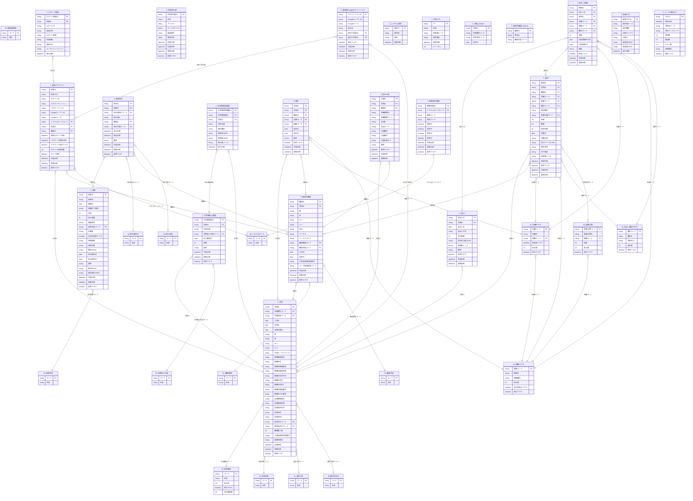
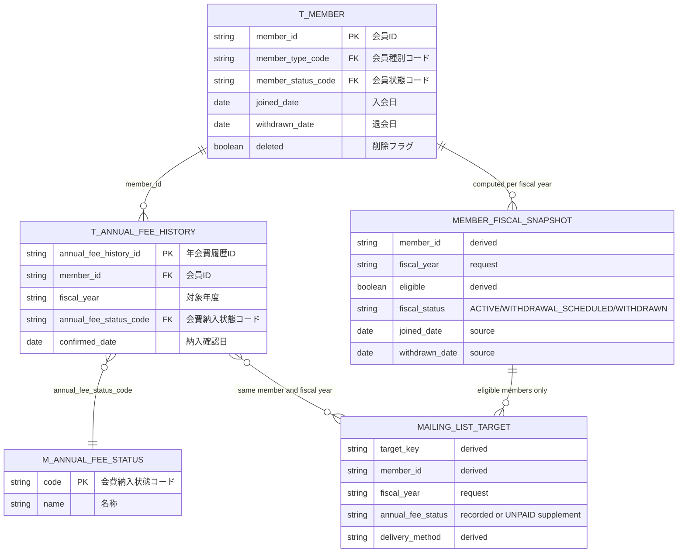

# データモデル設計書（スプレッドシートDB版）

更新日: 2026-05-11
スキーマバージョン: 2026-05-11-claim-v2（v333 本番反映済み）

---

## 1. 設計方針

- JSON列へ丸ごと保存する方式は採用しない（設定値のみJSON列を例外的に使用する）。
- スプレッドシートを「マスタ」と「トランザクションテーブル」に分割する。
- 1シート1責務、1行1レコード、主キー/外部キー列を明示する。
- 列名・マスタ名・テーブル名はすべて日本語命名とする。

### スプレッドシート構成（v261〜）

| スプレッドシート | 役割 | ID |
|---|---|---|
| **メイン DB** | 会員・研修・認証データ | `1GVlIzOG1Tsqw8fBXgZ__c8u4oMu-4_WCf0H3aVLESKs` |
| **ログ SS** | ログイン履歴・監査ログ・メール送信ログ | `1NmVv483UeehF8dqCdyNKOqOtv_fPKROhHN7011N23lw` |

ログ SS は `getLogSs_()` 経由でアクセスする。`LOG_SPREADSHEET_ID` スクリプトプロパティが未設定の場合はメイン DB にフォールバックする（安全移行）。

---

## 2. Mermaid ER 図


```mermaid
erDiagram

%% ===== マスタ =====
M_会員種別 {
  string コード PK
  string 名称
  int 表示順
  boolean 有効フラグ
  int 年会費金額
}
M_会員状態 {
  string コード PK
  string 名称
}
M_発送方法 {
  string コード PK
  string 名称
}
M_郵送先区分 {
  string コード PK
  string 名称
}
M_職員権限 {
  string コード PK
  string 名称
}
M_職員状態 {
  string コード PK
  string 名称
}
M_システムロール {
  string コード PK
  string 名称
}
M_研修状態 {
  string コード PK
  string 名称
}
M_申込状態 {
  string コード PK
  string 名称
}
M_会費納入状態 {
  string コード PK
  string 名称
}
M_申込者区分 {
  string コード PK
  string 名称
}
M_管理者権限 {
  string コード PK
  string 名称
}
M_組織マスタ {
  string 組織コード PK
  string 組織名
  string 組織種別
  int 表示順
  boolean 全役員表示フラグ
  boolean 有効フラグ
}
M_役職マスタ {
  string 役職コード PK
  string 役職名
  string 組織コード FK
  boolean 委員長フラグ
  int 表示順
  boolean 有効フラグ
}
M_支払い種別マスタ {
  string 種別コード PK
  string 種別名
  string 対象区分
  int 表示順
  boolean 有効フラグ
}
M_業務分類 {
  string 業務分類コード PK
  string 業務分類名
  string 組織コード FK
  int 単価
  int 表示順
  boolean 有効フラグ
}

%% ===== メインテーブル =====
T_会員 {
  string 会員ID PK
  string 会員種別コード FK
  string 会員状態コード FK
  date 入会日
  date 退会日
  date 退会処理日
  string 姓
  string 名
  string セイ
  string メイ
  string 代表メールアドレス
  string 携帯電話番号
  string 勤務先名
  string 勤務先郵便番号
  string 勤務先都道府県
  string 勤務先市区町村
  string 勤務先住所
  string 勤務先住所2
  string 勤務先電話番号
  string 勤務先FAX番号
  string 自宅郵便番号
  string 自宅都道府県
  string 自宅市区町村
  string 自宅住所
  string 自宅住所2
  string 発送方法コード FK
  string 郵送先区分コード FK
  int 職員数上限
  string 介護支援専門員番号
  string 事業所番号
  datetime 作成日時
  datetime 更新日時
  boolean 削除フラグ
}

T_事業所職員 {
  string 職員ID PK
  string 会員ID FK
  string 姓
  string 名
  string セイ
  string メイ
  string 氏名
  string フリガナ
  string メールアドレス
  string 職員権限コード FK
  string 職員状態コード FK
  date 入会日
  date 退会日
  string 介護支援専門員番号
  string メール配信希望コード
  datetime 作成日時
  datetime 更新日時
  boolean 削除フラグ
}

T_認証アカウント {
  string 認証ID PK
  string 認証方式
  string ログインID
  string パスワードハッシュ
  string パスワードソルト
  string GoogleユーザーID
  string Googleメール
  string システムロールコード FK
  string 会員ID FK
  string 職員ID FK
  datetime 最終ログイン日時
  datetime パスワード更新日時
  boolean アカウント有効フラグ
  int ログイン失敗回数
  boolean ロック状態
  datetime 作成日時
  datetime 更新日時
  boolean 削除フラグ
}

T_管理者Googleホワイトリスト {
  string ホワイトリストID PK
  string GoogleユーザーID
  string Googleメール
  string 表示名
  string 紐付け認証ID FK
  string 紐付け会員ID FK
  boolean 有効フラグ
  datetime 作成日時
  datetime 更新日時
  boolean 削除フラグ
}

T_研修 {
  string 研修ID PK
  string 研修名
  date 開催日
  string 開催終了時刻
  int 定員
  int 申込者数
  string 開催場所
  string 研修状態コード FK
  string 主催者
  boolean 法定外研修フラグ
  string 研修概要
  string 研修内容
  string 費用JSON
  date 申込開始日
  date 申込締切日
  string 講師
  string 案内状URL
  string 項目設定JSON
  datetime 作成日時
  datetime 更新日時
  boolean 削除フラグ
}

T_研修申込 {
  string 申込ID PK
  string 研修ID FK
  string 申込者区分コード FK
  string 申込者ID
  string 職員ID FK
  string 申込状態コード FK
  datetime 申込日時
  datetime 取消日時
  string 備考
  datetime 作成日時
  datetime 更新日時
  boolean 削除フラグ
}

T_外部申込者 {
  string 外部申込者ID PK
  string 氏名
  string フリガナ
  string メールアドレス
  string 電話番号
  string 事業所名
  datetime 同意日時
  datetime 作成日時
  datetime 更新日時
  boolean 削除フラグ
}

T_年会費納入履歴 {
  string 年会費履歴ID PK
  string 会員ID FK
  string 対象年度
  string 会費納入状態コード FK
  date 納入確認日
  int 金額
  string 備考
  datetime 作成日時
  datetime 更新日時
  boolean 削除フラグ
}

T_年会費更新履歴 {
  string 年会費更新履歴ID PK
  string 年会費履歴ID FK
  string 会員ID FK
  string 対象年度
  string 操作種別
  string 更新前JSON
  string 更新後JSON
  string 実行者メール
  datetime 実行日時
}

T_役員 {
  string 役員ID PK
  string 会員ID FK
  string 職員ID FK
  string 役職コード FK
  string 組織コード FK
  date 就任日
  date 退任日
  string 備考
  boolean 削除フラグ
  datetime 作成日時
  datetime 更新日時
}

T_振込口座 {
  string 口座ID PK
  string 会員ID FK
  string 職員ID FK
  string 金融機関名
  string 金融機関コード
  string 支店名
  string 支店コード
  string 口座種別
  string 口座番号
  string 口座名義カナ
  string 備考
  boolean 削除フラグ
  datetime 作成日時
  datetime 更新日時
}

T_支払い {
  string 支払いID PK
  string 会員ID FK
  date 支払い日
  string 支払い方法
  int 合計金額
  string 振込先口座JSON
  string 登録者メール
  string 備考
  boolean 削除フラグ
  datetime 作成日時
  datetime 更新日時
}

T_支払い明細 {
  string 明細ID PK
  string 支払いID FK
  string 請求ID FK
  string 役職コード FK
  string 組織コード FK
  string 種別コード FK
  int 金額
  date 対象期間FROM
  date 対象期間TO
  string 摘要
  boolean 削除フラグ
  datetime 作成日時
  datetime 更新日時
}

T_請求 {
  string 請求ID PK
  string 会員ID FK
  string 職員ID FK
  string 役職コード FK
  string 組織コード FK
  string 種別コード FK
  string 請求種別
  string 業務分類コード FK
  int 単価
  int 数量
  int 請求金額
  date 活動日
  string 活動内容
  string 添付ファイルURL
  string 請求状態
  string 却下理由
  string 承認者メール
  datetime 承認日時
  boolean 削除フラグ
  datetime 作成日時
  datetime 更新日時
}

T_システム設定 {
  string 設定キー PK
  string 設定値
  string 説明
  datetime 更新日時
}

%% v309: 管理者共有メモ（申し送りホワイトボード）
%% 他テーブルとのFK関係なし（更新者メールはスナップショット値）
%% 削除フラグ・作成日時なし（シングルトン運用のため不要）
T_共有メモ {
  string キー PK
  string 内容
  string 更新者メール
  string 更新者名
  datetime 更新日時
  int バージョン
}

T_画面項目権限 {
  string 権限定義ID PK
  string システムロールコード FK
  string 画面コード
  string 項目コード
  boolean 閲覧可
  boolean 登録可
  boolean 変更可
  boolean 削除可
  datetime 作成日時
  datetime 更新日時
  boolean 削除フラグ
}

%% ===== アーカイブシート（メインDB内・退会会員移動先）=====
T_会員_archive {
  string 会員ID PK
  string 会員種別コード
  string 会員状態コード
  date 退会日
}

T_事業所職員_archive {
  string 職員ID PK
  string 会員ID
  string 職員状態コード
}

%% ===== ログSS（別スプレッドシート）=====
T_ログイン履歴 {
  string ログイン履歴ID PK
  string 認証ID FK
  string ログインID
  string 認証方式
  string ログイン結果
  string 失敗理由
  string 接続元IP
  string ユーザーエージェント
  datetime 実行日時
}

T_監査ログ {
  string 監査ログID PK
  string 操作者メール
  string 操作種別
  string 対象テーブル
  string 対象ID
  string 変更前JSON
  string 変更後JSON
  datetime 実行日時
}

T_メール送信ログ {
  string ログID PK
  datetime 送信日時
  string 送信者メール
  string 件名テンプレート
  int 宛先数
  int 成功数
  int エラー数
  string 送信種別
  boolean 削除フラグ
}

%% ===== リレーション =====
T_会員 }o--|| M_会員種別 : "会員種別コード"
T_会員 }o--|| M_会員状態 : "会員状態コード"
T_会員 }o--o| M_発送方法 : "発送方法コード"
T_会員 }o--o| M_郵送先区分 : "郵送先区分コード"

T_事業所職員 }o--|| T_会員 : "会員ID"
T_事業所職員 }o--|| M_職員権限 : "職員権限コード"
T_事業所職員 }o--|| M_職員状態 : "職員状態コード"

T_認証アカウント }o--|| T_会員 : "会員ID"
T_認証アカウント }o--o| T_事業所職員 : "職員ID"
T_認証アカウント }o--|| M_システムロール : "システムロールコード"

T_管理者Googleホワイトリスト }o--o| T_認証アカウント : "紐付け認証ID"
T_管理者Googleホワイトリスト }o--o| T_会員 : "紐付け会員ID"

T_研修申込 }o--|| T_研修 : "研修ID"
T_研修申込 }o--|| M_申込者区分 : "申込者区分コード"
T_研修申込 }o--o| T_事業所職員 : "職員ID"
T_研修申込 }o--o| M_申込状態 : "申込状態コード"

T_研修 }o--|| M_研修状態 : "研修状態コード"

T_年会費納入履歴 }o--|| T_会員 : "会員ID"
T_年会費納入履歴 }o--|| M_会費納入状態 : "会費納入状態コード"

T_年会費更新履歴 }o--|| T_年会費納入履歴 : "年会費履歴ID"
T_年会費更新履歴 }o--|| T_会員 : "会員ID"

M_役職マスタ }o--|| M_組織マスタ : "組織コード"
M_業務分類 }o--|| M_組織マスタ : "組織コード"
T_役員 }o--o| T_会員 : "会員ID"
T_役員 }o--o| T_事業所職員 : "職員ID"
T_役員 }o--|| M_役職マスタ : "役職コード"
T_役員 }o--|| M_組織マスタ : "組織コード"
T_振込口座 }o--o| T_会員 : "会員ID"
T_振込口座 }o--o| T_事業所職員 : "職員ID"
T_支払い }o--|| T_会員 : "会員ID"
T_支払い明細 }o--|| T_支払い : "支払いID"
T_支払い明細 }o--o| T_請求 : "請求ID"
T_支払い明細 }o--|| M_役職マスタ : "役職コード"
T_支払い明細 }o--|| M_組織マスタ : "組織コード"
T_支払い明細 }o--|| M_支払い種別マスタ : "種別コード"
T_請求 }o--o| T_会員 : "会員ID"
T_請求 }o--o| T_事業所職員 : "職員ID"
T_請求 }o--|| M_役職マスタ : "役職コード"
T_請求 }o--|| M_組織マスタ : "組織コード"
T_請求 }o--|| M_支払い種別マスタ : "種別コード"
T_請求 }o--o| M_業務分類 : "業務分類コード"

T_画面項目権限 }o--|| M_システムロール : "システムロールコード"

T_ログイン履歴 }o--o| T_認証アカウント : "認証ID"
```

---

## 3. マスタ一覧

### 3.1 `M_会員種別`
- 用途: 会員の区分管理
- 列: `コード`, `名称`, `表示順`, `有効フラグ`, `年会費金額`
- 初期値:
  - `INDIVIDUAL`（個人会員, 3,000円）
  - `BUSINESS`（事業所会員, 8,000円）
  - `SUPPORT`（賛助会員, 5,000円）

### 3.2 `M_会員状態`
- 用途: 会員状態の管理
- 列: `コード`, `名称`, `表示順`, `有効フラグ`
- 初期値: `ACTIVE`（有効）, `WITHDRAWAL_SCHEDULED`（退会予定）, `WITHDRAWN`（退会）, `TRANSFERRED`（移行済み）

### 3.3 `M_発送方法`
- 用途: 通知媒体（メール/郵送）
- 列: `コード`, `名称`, `表示順`, `有効フラグ`

### 3.4 `M_郵送先区分`
- 用途: 定期郵送先（自宅/勤務先）
- 列: `コード`, `名称`, `表示順`, `有効フラグ`

### 3.5 `M_職員権限`
- 用途: 事業所職員の権限（3階層）
- 初期値:
  - `REPRESENTATIVE`（代表者）: 職員の追加・削除、代表者変更が可能
  - `ADMIN`（管理者）: 職員の追加・削除が可能（代表者の変更は不可）
  - `STAFF`（一般）: 自分の情報のみ閲覧・編集可能

### 3.6 `M_職員状態`
- 用途: 在籍/退職
- 列: `コード`, `名称`, `表示順`, `有効フラグ`

### 3.7 `M_システムロール`
- 用途: ログイン主体ごとのシステム権限
- 初期値: `OFFICE_ADMIN`, `INDIVIDUAL_MEMBER`, `BUSINESS_ADMIN`, `BUSINESS_MEMBER`

### 3.8 `M_研修状態`
- 用途: 研修レコード自体のライフサイクル状態を表す。申込可否は `申込開始日` / `申込締切日` / `開催日` / `定員` / `申込者数` から API 層で導出する。
- 初期値: `DRAFT`（下書き）, `PUBLISHED`（公開）, `CANCELLED`（中止）, `ARCHIVED`（アーカイブ）
- 後方互換: 旧値 `OPEN` / `CLOSED` は既存データ読み取り時に `PUBLISHED` とみなし、申込可否は導出値 `applicationStatus` / `isApplicationOpen` を正とする。

### 3.9 `M_申込状態`
- 用途: 申込状態（申込済/取消）

### 3.10 `M_会費納入状態`
- 用途: 年会費の納入状態

### 3.11 `M_申込者区分`
- 用途: 研修申込者が会員か非会員かを区別
- 初期値: `MEMBER`（会員）, `EXTERNAL`（非会員）

### 3.12 `M_管理者権限`
- 用途: 管理画面の権限レベル管理

### 3.13 `M_組織マスタ` / `M_役職マスタ` / `M_支払い種別マスタ` — v295追加

- 用途: 役員管理、支払い、請求の分類マスタ。
- `M_組織マスタ`: 本部、理事会、監事会、事務局、各委員会などの組織定義。
- `M_役職マスタ`: 会長、副会長、理事、監事、委員長、委員などの役職定義。`組織コード` で組織に属する。
- `M_支払い種別マスタ`: 役員報酬、活動費、謝礼、交通費、消耗品費、その他などの支払い・請求種別。
- 管理者ポータルのシステム設定マスタ管理から CRUD 可能。ただし参照中のマスタ削除はバックエンドで拒否する。

### 3.14 `M_業務分類` — v333 追加

- 用途: 役員の活動報告で選択する業務内容と単価を管理する。
- `組織コード`: 活動部（組織）に紐づく。会員側では、選択した活動部に属する有効な業務分類だけを表示する。
- `単価`: 活動報告の請求金額として自動適用される。数量は常に 1。
- 管理者ポータルの役員マスタ設定から CRUD 可能。ただし既存請求で使用中の業務分類は削除不可。

---

## 4. テーブル詳細

### 4.1 `T_会員` — メインDB

主キー: `会員ID`

| フィールド | 個人会員 | 事業所会員 | 賛助会員 |
|---|---|---|---|
| 姓/名/セイ/メイ | 必須 | ブランク | 必須 |
| 介護支援専門員番号 | 必須（8桁半角数字） | ブランク | 任意 |
| 勤務先名〜住所2 | 郵送先=OFFICE時は名前必須、住所2任意 | 基本情報として使用 | 同左 |
| 自宅住所系 | 郵送先=HOME時に使用 | 使用しない | 郵送先=HOME時に使用 |
| 発送方法/郵送先区分 | 使用 | ブランク | 使用 |
| 事業所番号 | 使用しない | 必須（半角英数字10文字） | 使用しない |

- `退会処理日`：退会手続き実施日。`退会日` は年度末 3/31 を自動計算。
- `移行日`：同一人物が別会員種別・別事業所職員レコードへ移行した日。`会員状態コード=TRANSFERRED` の場合に記録する。
- `勤務先住所2` / `自宅住所2`：建物名・部屋番号（任意）。v261 で入会申込フォームに追加。
- `事業所番号` による二重登録防止（公開ポータル申込時）。

### 4.2 `T_事業所職員` — メインDB

外部キー: `会員ID` → `T_会員`

- `職員権限コード='REPRESENTATIVE'` の行が事業所代表者情報の正本。
- `姓`/`名`/`セイ`/`メイ` が構造化列の正本。`氏名`/`フリガナ` は表示用スナップショット。
- `メール配信希望コード`（YES/NO）: 特定電子メール法オプトイン準拠。

### 4.3 `T_認証アカウント` — メインDB

- 会員ログイン: `認証方式='PASSWORD'` / `ログインID + ハッシュ+ソルト`
- 管理者ログイン: `認証方式='GOOGLE'` / `Session.getActiveUser()` + ホワイトリスト照合
- パスワード平文は保存しない。
- v118 以降 GoogleユーザーID（sub）照合は廃止。Googleメールで照合。

### 4.4 `T_管理者Googleホワイトリスト` — メインDB

- 追加・更新・削除時は `admin_wl_v1` / `admin_auth_v1` キャッシュを即時無効化。
- 紐付け不整合（WLの会員IDと認証アカウントの会員IDが不一致）はログイン拒否。

### 4.5 `T_研修` — メインDB

#### `費用JSON` スキーマ
```json
[{ "label": "会員", "amount": 0 }, { "label": "非会員", "amount": 1000 }]
```

#### `項目設定JSON` スキーマ
```json
{
  "fieldConfig": { "organizer": true, "summary": true, "fees": true, ... },
  "cancelAllowed": true,
  "inquiryPerson": "事務局 田中",
  "inquiryContactType": "EMAIL",
  "inquiryContactValue": "support@example.com"
}
```

### 4.6 `T_研修申込` — メインDB

- `申込者区分コード + 申込者ID` がポリモーフィック設計の正本（`MEMBER` = 会員ID, `EXTERNAL` = 外部申込者ID）。
- `会員ID` 列は後方互換として保持。

### 4.7 `T_外部申込者` — メインDB

- 収集目的: 研修申込の受付・確認連絡のみ（個人情報保護法対応）。
- 保管期間: 研修終了日の翌年4月1日まで（`削除フラグ` で管理）。

### 4.8 `T_年会費納入履歴` / `T_年会費更新履歴` — メインDB

- `会員ID + 対象年度` の組合わせは重複不可。
- `PAID` の場合 `納入確認日` 必須。
- 更新ごとに `T_年会費更新履歴` に差分を記録（監査ログ兼用）。

### 4.9 `T_システム設定` — メインDB

主キー: `設定キー`。代表的なキー：
- `CREDENTIAL_EMAIL_ENABLED` / `CREDENTIAL_EMAIL_FROM` / `CREDENTIAL_EMAIL_SUBJECT` / `CREDENTIAL_EMAIL_BODY`
- `PUBLIC_PORTAL_*`（公開ポータル各カードの表示設定）
- `ANNUAL_FEE_TRANSFER_ACCOUNT`

### 4.10 `T_会員_archive` / `T_事業所職員_archive` — メインDB（v261追加）

- 退会日から3年超の WITHDRAWN 会員を `runArchiveOldWithdrawnMembers()` で定期移動（月次推奨）。
- 同一スプレッドシート内の別シート。スキーマは元テーブルと同一。

### 4.11 `T_変更申請` — メインDB（v264追加）

公開ポータルから送信された変更・退会申請を管理者承認まで保存するキューテーブル。

| 列 | 型 | 説明 |
|---|---|---|
| `申請ID` | string PK | `CR` + timestamp + token prefix |
| `会員ID` | string FK | T_会員 |
| `会員種別コード` | string | INDIVIDUAL / BUSINESS |
| `申請種別コード` | string | MEMBER_APPLICATION / MEMBER_UPDATE / WITHDRAWAL / STAFF_ADD / STAFF_REMOVE |
| `申請状態コード` | string | PENDING / APPROVED / REJECTED |
| `申請内容JSON` | JSON | `MEMBER_APPLICATION` は `{ applicationPayload: {...} }`、変更系は `{ fields: {}, staffAdd: [], staffRemove: [] }` |
| `連絡先メールアドレス` | string | 申請者入力の返信専用メール（DBとは別） |
| `申請者表示名` | string | 申請者の氏名 or 事業所名 |
| `申請日時` | datetime ISO | |
| `処理日時` | datetime ISO | 承認/却下日時 |
| `処理者メールアドレス` | string | 管理者のGoogleメール |
| `処理備考` | string | 却下理由等 |
| `作成日時` | datetime ISO | |
| `更新日時` | datetime ISO | |
| `削除フラグ` | boolean | |

**承認ワークフロー:**
1. 公開ポータルで入会・変更・退会申請 → `T_変更申請` に PENDING で記録
2. 管理者が「変更申請管理コンソール」で確認・承認 → DB 反映 + 申請者に通知メール
3. 却下の場合 → DB 変更なし + 申請者に却下メール

**初回作成:** `submitMemberApplication_` / `submitPublicChangeRequest_` 呼び出し時に T_変更申請 が存在しない場合は自動作成。正式なスキーマ反映は `docs/04_DB_OPERATION_RUNBOOK.md` のスキーマ変更手順に従い、Apps Script エディタ経由の差分正規化を標準とする。

### 4.11.1 同一人物移行ログ `T_人物統合ログ` — メインDB（v335追加）

同じ `介護支援専門員番号` を持つ人物の会員種別変更・事業所職員転籍・重複修復の監査ログ。

| 列 | 説明 |
|---|---|
| `ログID` | `PML` + timestamp + UUID prefix |
| `処理種別` | `INDIVIDUAL_TO_STAFF` / `STAFF_TO_INDIVIDUAL` / `STAFF_TO_STAFF` / `REPAIR_MEMBER_CM_DUPLICATE` |
| `介護支援専門員番号` | 同一人物判定キー。空の場合は自動統合しない。 |
| `旧会員ID` / `旧職員ID` | 移行元 |
| `新会員ID` / `新職員ID` | 移行先 |
| `結果コード` | `OK` など |
| `詳細JSON` | 移行した関連テーブル件数、事業所自動退会有無など |
| `実行者メール` | 手動修復・承認者がある場合に記録 |
| `実行日時` / `作成日時` / `削除フラグ` | 監査管理用 |

関連レコードの移行対象は `T_研修申込`, `T_役員`, `T_振込口座`, `T_請求`, `T_認証アカウント`, `T_管理者Googleホワイトリスト`。会員レコード同士の重複修復では `T_支払い`, `T_年会費納入履歴`, `T_年会費更新履歴` も移行対象とする。事業所職員を含む移行では、事業所会員そのものの支払い・年会費履歴を誤移行しないため対象外とする。

**T_システム設定 追加キー（v264〜）:**
- `BIZ_REP_EMAIL_ENABLED/SUBJECT/BODY` — 事業所代表者入会時メール
- `BIZ_STAFF_EMAIL_ENABLED/SUBJECT/BODY` — 事業所メンバー入会時メール
- `STAFF_ADD_STAFF_EMAIL_ENABLED/SUBJECT/BODY` — 職員追加承認時メール
- `STAFF_ADD_REP_EMAIL_ENABLED/SUBJECT/BODY` — 職員追加代表者通知
- `IND_SUPP_EMAIL_ENABLED`（v266〜） — 個人・賛助会員入会時メールON/OFF

### 4.12 役員管理テーブル — メインDB（v295〜v297追加）

対象テーブル:
- `T_役員`
- `T_振込口座`
- `T_支払い`
- `T_支払い明細`
- `T_請求`

#### 人物識別の XOR 制約

`T_役員` / `T_振込口座` / `T_請求` は、人物を `会員ID` または `職員ID` のどちらか一方で識別する。

| 対象 | `会員ID` | `職員ID` |
|---|---|---|
| 個人会員・賛助会員 | non-empty | empty |
| 事業所職員 | empty | non-empty |

- `会員ID` と `職員ID` の同時指定は禁止。
- どちらも空のレコードは禁止。
- 制約は Apps Script の API 層で保証する。スプレッドシート自体に DB 制約は存在しない。

#### `T_役員`

- 役員割当ての正本。
- `役職コード` / `組織コード` は各マスタを参照する。
- 事業所職員が退職状態になった場合、`autoRetireOfficerByStaffId_` により現役役員を自動退任する。
- `updateOfficerLinkage_` により、個人会員と事業所職員の紐づけ変更を行える。`T_振込口座` の人物紐づけも同時に移行する。

#### `T_振込口座`

- 役員の受取口座。人物単位で 1 口座を正とする。
- `会員ID` / `職員ID` の XOR で所有者を識別する。

#### `T_支払い` / `T_支払い明細`

- `T_支払い` は支払いヘッダー、`T_支払い明細` は明細行。
- 明細は `請求ID` を任意で参照し、請求から支払いへ処理済み状態を連動できる。
- `振込先口座JSON` は支払い時点の口座スナップショットであり、後続の口座変更に追従しない。

#### `T_請求`

- 役員本人が会員マイページから申請する活動費等の請求。
- `請求種別` は `ACTIVITY_REPORT`（活動報告）または `EXPENSE_CLAIM`（経費請求）。
- 活動報告では `業務分類コード`、`単価`、`数量=1` を保存し、`請求金額=単価` とする。
- 経費請求では `活動内容` を請求内容として扱い、領収書等の添付ファイルを必須とする。既存レコードは読み取り時に `EXPENSE_CLAIM` として扱い、添付必須を遡及適用しない。
- `添付ファイルURL` は Drive に保存した添付ファイル情報の JSON 配列。
- `請求状態` は申請、承認、却下、支払い済みなどの業務状態を表す。承認者・承認日時・却下理由を保持する。

#### `T_共有メモ` — v309追加

- **用途**: 管理者間の申し送り・備忘録用ホワイトボード。年会費管理コンソール専用。
- **主キー**: `キー`（文字列。現在は `ANNUAL_FEE_BOARD` 固定値の 1 行運用）。
- **関係**: 他テーブルとのFK関係は一切持たない。完全スタンドアロン。
- **`更新者メール` / `更新者名`**: `checkAdminBySession_()` が返す `loginId`（Googleメール）と `displayName` を書き込み時点のスナップショットとして保存。`T_管理者Googleホワイトリスト` への厳密なFK参照ではないため、管理者削除後も記録は残存する（意図的設計）。
- **`削除フラグ` なし**: シングルトンのホワイトボードであり、レコードのライフサイクル管理（論理削除）の概念が不要なため省略。
- **`作成日時` なし**: 上書き運用のため最終更新日時（`更新日時`）のみ保持。
- **`バージョン`**: アプリケーション層の楽観的排他制御用整数。DB レベルの制約ではない。
- **`rebuildDatabaseSchema()` 対応**: `テーブル定義['T_共有メモ']` に追加済みのため `createTableSheets_()` が自動作成する。`cleanupNonSchemaSheets_()` による誤削除も発生しない。
- **初回作成**: `runAddSharedMemoSheetForV309()` 関数を Apps Script エディタから実行、または `saveSharedMemo_()` の初回呼び出し時に自動作成。

---

## 5. ログ SS テーブル（別スプレッドシート・v261〜）

ログ SS ID: `1NmVv483UeehF8dqCdyNKOqOtv_fPKROhHN7011N23lw`

GAS コードは `getLogSs_()` 経由でアクセスする。`LOG_SPREADSHEET_ID` 未設定時はメインDBにフォールバック。

### 5.1 `T_ログイン履歴`

- 用途: ログイン成功/失敗の監査ログ
- 主キー: `ログイン履歴ID`
- `認証ID` (FK → `T_認証アカウント`) — NULL可（失敗時）

### 5.2 `T_監査ログ`

- 用途: 管理操作の変更履歴
- 主キー: `監査ログID`
- 列: `操作者メール`, `操作種別`, `対象テーブル`, `対象ID`, `変更前JSON`, `変更後JSON`, `実行日時`

### 5.3 `T_メール送信ログ`

- 用途: 一括メール送信の実績記録（v261でバグ修正済み）
- 主キー: `ログID`
- 列: `送信日時`, `送信者メール`, `件名テンプレート`, `宛先数`, `成功数`, `エラー数`, `送信種別`

---

## 6. 認証・権限の運用ルール

- 全処理は `T_認証アカウント` を起点に認可判定する。
- 会員ログイン: `ログインID + パスワード`（Googleログイン不使用）。
- 管理者ログイン: `checkAdminBySession_()` → `Session.getActiveUser().getEmail()` → `T_管理者Googleホワイトリスト` メール照合。
- ログイン結果は `T_ログイン履歴` に記録。失敗回数・ロック状態を `T_認証アカウント` に更新。
- 画面ごとの項目操作可否は `T_画面項目権限` で管理。
- パスワードハッシュ+ソルトのみ保存（平文保存禁止）。2026-04-30 以降の新規保存形式は versioned PBKDF2-HMAC-SHA256 + verifier-side pepper。pepper は Script Properties の `PASSWORD_HASH_PEPPER_V1` で管理し、DB には保存しない。
- pepper の値は integrated/public・member split・admin split の各 Apps Script project の Script Properties に同一値で設定する。本番反映前の必須条件であり、値は Git、handover、docs、ログ、チャット、生成物へ記録しない。`.env` は Apps Script 本番 runtime の正本にしない。

---

## 7. 退会・削除フラグ運用ルール

- 退会/退職時は原則 `削除フラグ=false`（履歴保持）。
- 中途退会意図ありの場合のみ即時 `削除フラグ=true`。
- `退会日の翌年4/1` 到達時に自動 `削除フラグ=true`。
- 退会から3年超: `runArchiveOldWithdrawnMembers()` でアーカイブシートへ移動（T_会員_archive / T_事業所職員_archive）。
- データ管理コンソールの削除: 物理削除なし。`WITHDRAWN/LEFT + 削除フラグ=true + 認証無効化` の論理削除。

---

## 8. 廃止済み

| 名称 | 廃止理由 |
|---|---|
| `M_開催形式` | `T_研修` から `開催形式コード` 列を削除済み |
| `T_ログイン履歴`（メインDB） | v261でログSSに移行済み |
| `T_監査ログ`（メインDB） | v261でログSSに移行済み |
| `T_メール送信ログ`（メインDB） | v261でログSSに移行済み |

---

## 9. スキーマバージョン履歴

| バージョン | 日付 | 変更概要 |
|---|---|---|
| 2026-05-11-claim-v2 | 2026-05-12 | v333 本番反映。活動報告 / 経費請求 2系統化のため、`M_組織マスタ.全役員表示フラグ`、`M_業務分類`、`T_請求.請求種別/業務分類コード/単価/数量` を追加。 |
| 2026-05-04-01 | 2026-05-04 | v295〜v297 の役員管理・請求管理スキーマを正本化。`M_組織マスタ` / `M_役職マスタ` / `M_支払い種別マスタ`、`T_役員` / `T_振込口座` / `T_支払い` / `T_支払い明細` / `T_請求`、`会員ID` / `職員ID` XOR 制約を追加。 |
| 2026-04-25-01 | 2026-04-25 | T_変更申請テーブル追加（v264）。T_システム設定に事業所メール・個人賛助メール設定キー13件追加（v264〜v266）。 |
| 2026-04-24-01 | 2026-04-24 | ログSS分離（T_ログイン履歴・T_監査ログ・T_メール送信ログ→別SS）、T_会員_archive / T_事業所職員_archive 追加。T_メール送信ログ書き込みバグ修正（v261） |
| 2026-04-15-01 | 2026-04-15 | `T_会員` に `勤務先住所2` / `自宅住所2`（建物名・部屋番号）を追加 |
| 2026-03-27-01 | 2026-03-27 | `T_事業所職員` に `メール配信希望コード` を追加（v133。特定電子メール法オプトイン準拠） |
| 2026-03-26-03 | 2026-03-26 | `T_事業所職員` に `姓/名/セイ/メイ` を追加 |
| 2026-03-24-01 | 2026-03-24 | `T_会員` に `退会処理日` を追加 |
| 2026-03-17-v99 | 2026-03-17 | `T_会員` に `事業所番号` を追加、`T_事業所職員` に `介護支援専門員番号` を追加、`M_職員権限` に `REPRESENTATIVE` を追加 |
| 2026-03-09-02 | 2026-03-09 | 賛助会員追加、`T_研修` 拡張（費用JSON・項目設定JSON）、`T_システム設定` 追加 |
| 初版 | 2026-02-25 | 初期スキーマ構築 |

---

## 10. GAS実装メモ

- `rebuildDatabaseSchema()`: メインDBシートを定義に基づき再作成・正規化する。
- `normalizeTableColumns_()`: 既存データを保持したまま、定義済みテーブルへ不足列を差分追加・列順正規化する。v295/v297 の本番移行では Apps Script エディタから一時関数経由で実行済み。
- `getLogSs_()`: ログSS取得。`LOG_SPREADSHEET_ID` 未設定時はメインDBにフォールバック。
- `setupLogSpreadsheet()`: ログSS新規作成 + スクリプトプロパティ設定（初回のみ）。
- `rebuildLogDatabaseSchema()`: ログSSのシート構造を再作成。
- `migrateLogsToLogSpreadsheet()`: メインDBの既存ログ行をログSSにコピー。
- `runArchiveOldWithdrawnMembers()`: 退会から3年超の会員をアーカイブシートへ移動（月次トリガー推奨）。
- `cleanupNonSchemaSheets_()`: 定義外シートを削除。

---

## v305 Addendum: Fiscal-Year Derived Model and Human-Readable ER

Status: production `v305` / admin split `@65`.

No physical DB table or column was added in v305. The change is a canonical derived model used by admin output features.

### Derived Entity: MemberFiscalSnapshot

`MemberFiscalSnapshot` is not stored as a sheet. It is computed by `getMemberFiscalSnapshot_(memberRow, fiscalYear)` from `T_会員` and is the source of truth for fiscal-year membership targeting in mailing-list and roster outputs.

| Field | Source | Meaning |
|---|---|---|
| `memberId` | `T_会員.会員ID` | Target member key |
| `fiscalYear` | Request payload | Selected fiscal year |
| `eligible` | derived | Whether the person/member belonged to the association during the selected fiscal year |
| `memberStatus` | derived from `会員状態コード`, `入会日`, `退会日` | Fiscal-year status used for output filters |
| `joinedDate` | `T_会員.入会日` | Membership start date |
| `withdrawnDate` | `T_会員.退会日` | Membership end date |
| `reason` | derived | Exclusion reason for debugging/audit review |

### v305 ER Supplement


```mermaid
erDiagram
  T_MEMBER {
    string member_id PK "会員ID"
    string member_type_code FK "会員種別コード"
    string member_status_code FK "会員状態コード"
    date joined_date "入会日"
    date withdrawn_date "退会日"
    boolean deleted "削除フラグ"
  }

  T_ANNUAL_FEE_HISTORY {
    string annual_fee_history_id PK "年会費履歴ID"
    string member_id FK "会員ID"
    string fiscal_year "対象年度"
    string annual_fee_status_code FK "会費納入状態コード"
    date confirmed_date "納入確認日"
  }

  M_ANNUAL_FEE_STATUS {
    string code PK "会費納入状態コード"
    string name "名称"
  }

  MEMBER_FISCAL_SNAPSHOT {
    string member_id "derived"
    string fiscal_year "request"
    boolean eligible "derived"
    string fiscal_status "ACTIVE/WITHDRAWAL_SCHEDULED/WITHDRAWN"
    date joined_date "source"
    date withdrawn_date "source"
  }

  MAILING_LIST_TARGET {
    string target_key "derived"
    string member_id "derived"
    string fiscal_year "request"
    string annual_fee_status "recorded or UNPAID supplement"
    string delivery_method "derived"
  }

  T_MEMBER ||--o{ T_ANNUAL_FEE_HISTORY : "member_id"
  T_ANNUAL_FEE_HISTORY }o--|| M_ANNUAL_FEE_STATUS : "annual_fee_status_code"
  T_MEMBER ||--o{ MEMBER_FISCAL_SNAPSHOT : "computed per fiscal year"
  MEMBER_FISCAL_SNAPSHOT ||--o{ MAILING_LIST_TARGET : "eligible members only"
  T_ANNUAL_FEE_HISTORY }o--o{ MAILING_LIST_TARGET : "same member and fiscal year"
```

### Fiscal-Year Eligibility Formula

For a selected fiscal year `Y`, where `start = Y-04-01` and `end = (Y+1)-03-31`:

```text
eligible = not deleted
       and joinedDate <= end
       and (withdrawnDate is empty or withdrawnDate >= start)
```

Operational interpretation:

- Withdrawn during the selected fiscal year: included.
- Withdrawn before the selected fiscal year starts: excluded.
- Joined after the selected fiscal year ends: excluded.
- Missing annual-fee row: `UNPAID` only when `eligible = true`.

### Schema Version Note

v305 does not require `rebuildDatabaseSchema()` because it changes derived logic, generated admin artifact, and documentation only. The latest physical schema version remains the previous physical DB schema version unless a later release adds or removes actual sheet columns.
