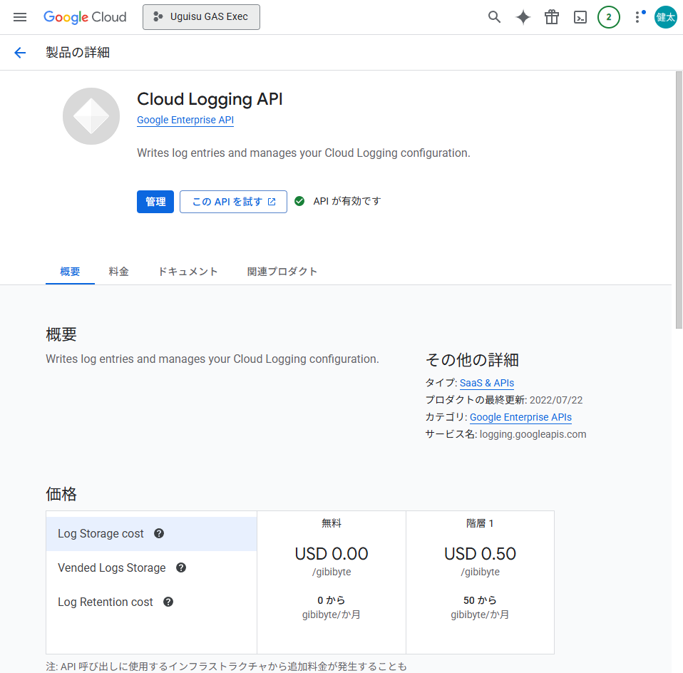
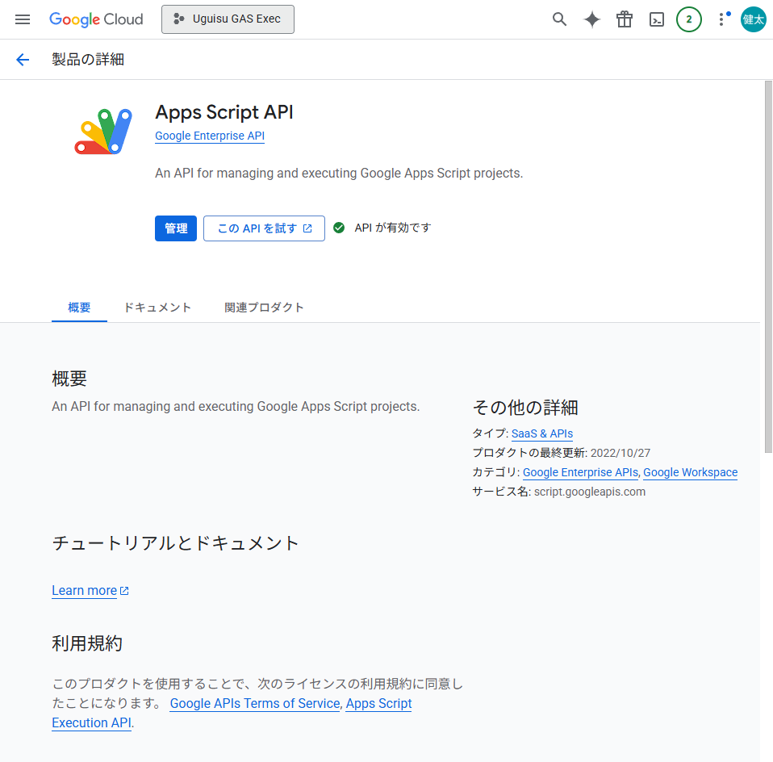
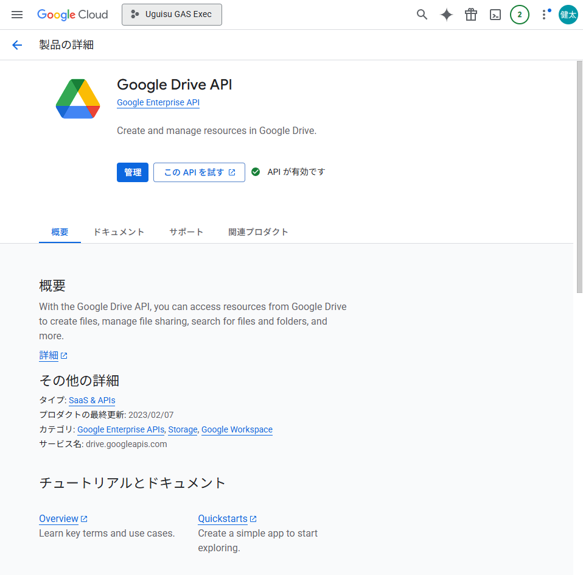
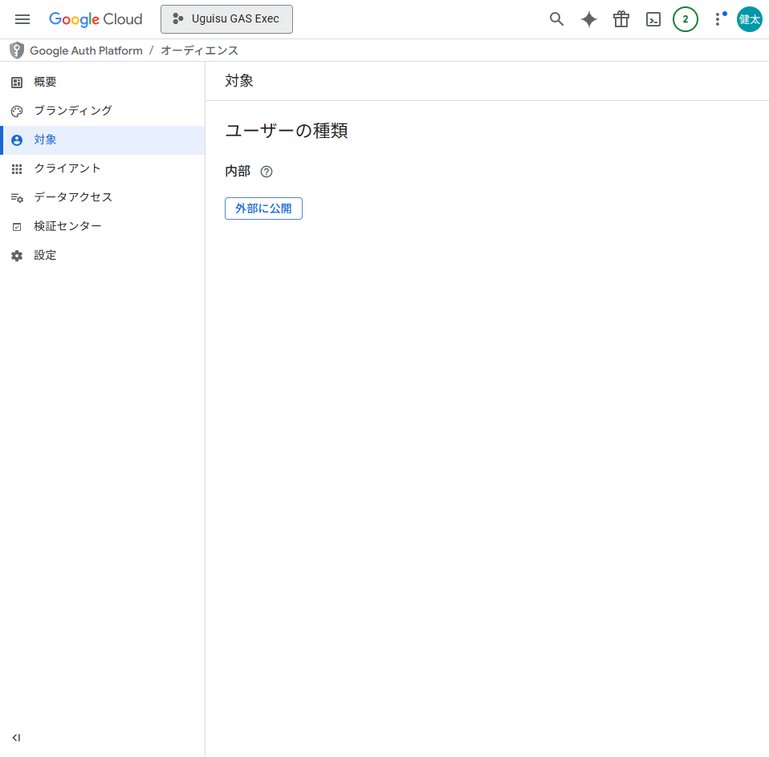
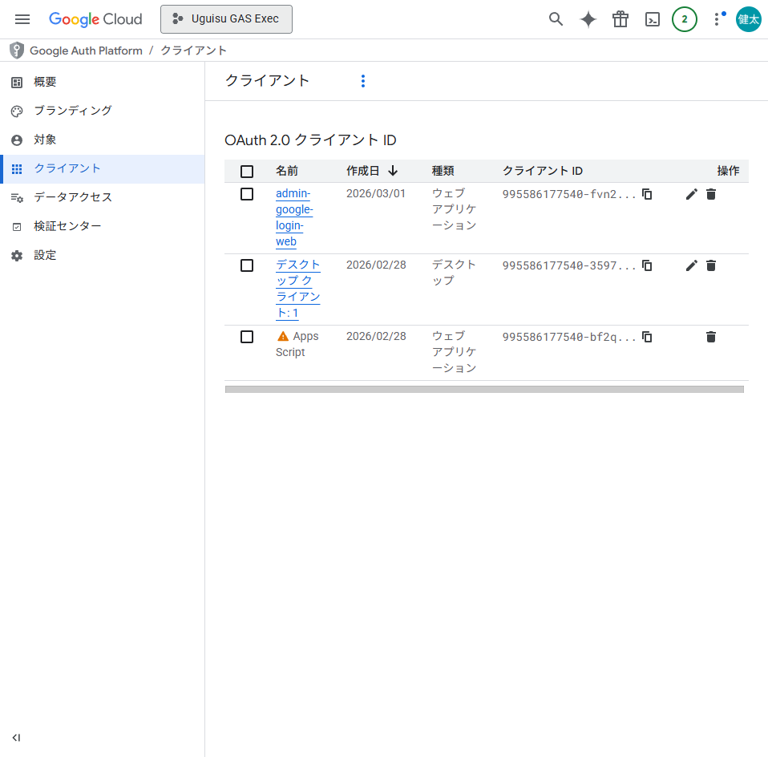
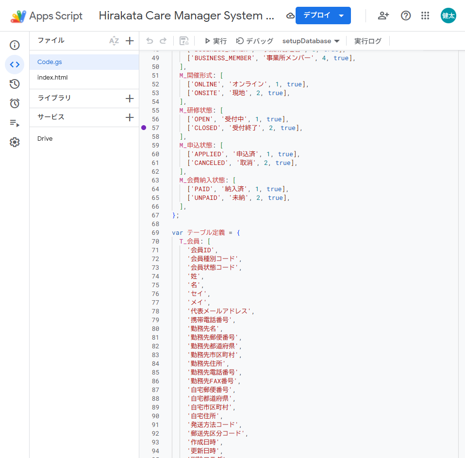

# GCP設定手順書（管理者Google認証・GAS連携）

## 1. 目的
- 本システムで必要なGCP/API/OAuth設定を再現可能な手順として固定する。
- 誰が実施しても同じ設定状態を確認できるよう、証跡画像を残す。

## 2. 対象
- GCPプロジェクト: `uguisu-gas-exec-20260225191000`
- Apps Scriptプロジェクト: `Hirakata Care Manager System (UGUISU PROD)`
- 実施日: 2026-02-28

## 3. 事前条件
1. Google Cloud Console へアクセス可能
2. 対象プロジェクト編集権限を保有
3. Apps Script編集権限を保有
4. `clasp` 利用時は `k.noguchi@uguisunosato.or.jp` で認証済み

## 4. 実施手順
### 4.1 GCP APIの有効化
1. Google Cloud Consoleで対象プロジェクトを選択
2. `API とサービス` > `ライブラリ` から以下を有効化
- Apps Script API
- Google Drive API
- Cloud Logging API

証跡:




### 4.2 Google Auth Platform 設定
1. `Google Auth Platform` > `対象` を開く
2. ユーザータイプを `内部` に設定

証跡:


### 4.3 OAuthクライアント作成（管理者ログイン用）
1. `Google Auth Platform` > `クライアント` > `クライアントを作成`
2. クライアントタイプ: `ウェブ アプリケーション`
3. 名前: `admin-google-login-web`
4. 承認済みのJavaScript生成元:
- `https://script.google.com`
5. 作成後、一覧にクライアントが追加されたことを確認

注意:
- `script.googleusercontent.com` は許可対象ドメイン制約により登録不可

証跡:


### 4.4 Apps Script 高度なサービス追加
1. Apps Scriptエディタを開く
2. 左メニュー `サービス` > `+` から `Drive API` を追加
3. サービス一覧に `Drive` が表示されることを確認

証跡:


## 5. 設定結果（最終状態）
1. GCP API
- `script.googleapis.com`: 有効
- `drive.googleapis.com`: 有効
- `logging.googleapis.com`: 有効

2. Auth Platform
- 対象: `内部`
- OAuthクライアント: `admin-google-login-web` 作成済み

3. Apps Script
- 高度なサービス: `Drive API` 追加済み

## 6. 動作確認コマンド（ローカル）
```powershell
gcloud config get-value project
gcloud auth list
npx clasp apis
```

期待値:
1. projectが `uguisu-gas-exec-20260225191000`
2. ACTIVEアカウントが `k.noguchi@uguisunosato.or.jp`
3. `npx clasp apis` に `drive` が表示される

## 7. トラブルシュート
1. clasp認証アカウントが違う
- `npx clasp logout`
- `npx clasp login --no-localhost`
- 正しいGoogleアカウントで再認証

2. localhostコールバックに接続できない
- 仕様上、環境により `localhost:8888` が到達不能な場合がある
- `--no-localhost` モードで認証コードを手動貼り付けで回避可能

3. OAuthクライアント作成時のドメインエラー
- 生成元は `https://script.google.com` のみ設定
- 許可されないドメインは追加しない
