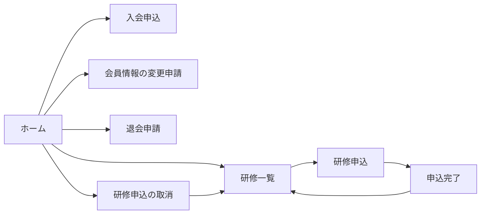
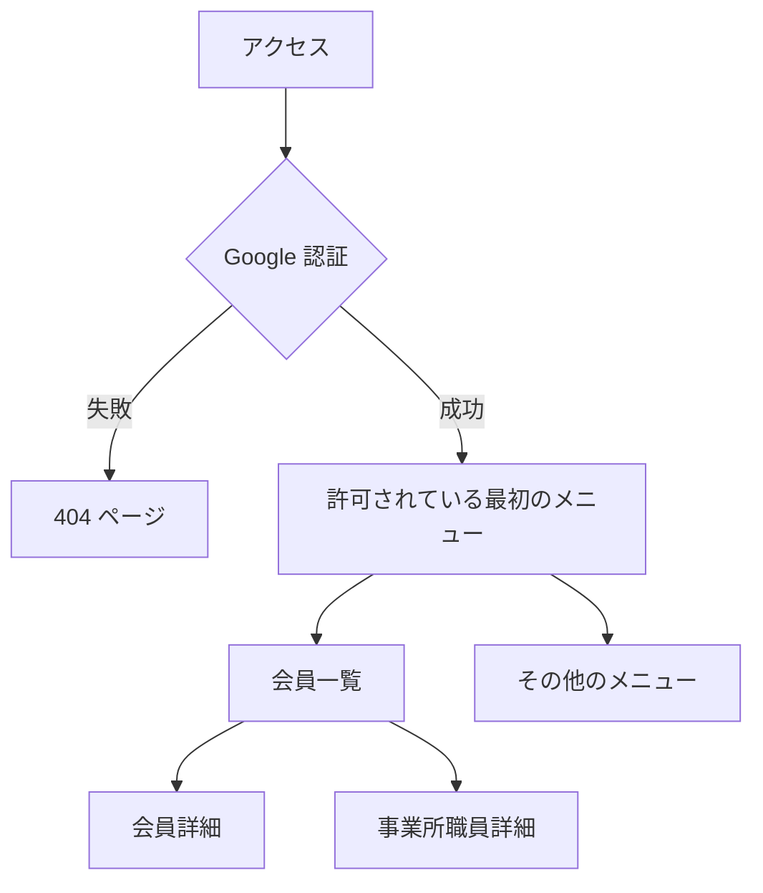

# 【4. UI/UX 画面遷移定義書】

枚方市介護支援専門員連絡協議会 会員システム
版数: 1.2 ／ 初版: 2026-09-03 ／ 最終更新: 2026-09-04

> **本書の位置づけ**: **画面の一覧・遷移・表示条件・UI 規約**の正本。
> 業務ルールは RD、技術構成は TRD、作業範囲と非機能目標は SOW、
> データ構造と API 契約はデータ・IF 定義書が正本であり、**本書には再掲しない**。
> 権限とメニューの対応は `scripts/menu-registry.mjs` が実装上の正本。本書は**取得元を示す**にとどめる。

## 改訂履歴

| 版 | 日付 | 変更内容 |
|---|---|---|
| 1.0 | 2026-09-03 | 初版 |
| 1.1 | 2026-09-04 | 画面 ID・遷移元/遷移先を追加。画面を止める条件と通知の規約を追加 |
| 1.2 | 2026-09-04 | 整合確認（`docs/267` §4）を実施。画面数の誤り（会員 2→3・管理 20→18）を修正。パンくずの修正が v376.70 でリリース済みであることを反映。未確定事項を SOW §8 への参照に一本化 |

---

## 1. 入口は 3 つ（利用者から見た区切り）

同一のコードベースから 3 つの Web アプリを配信しており、**利用者から見ると別のサイト**である。

| 入口 | 対象 | 認証 | 既定の画面 |
|---|---|---|---|
| **公開ポータル** | 誰でも（会員でない人を含む） | なし | ホーム |
| **会員マイページ** | 会員本人・事業所職員 | ログイン ID（介護支援専門員番号）＋ パスワード | 会員情報の確認・変更 |
| **管理ポータル** | 事務局・役員 | Google アカウント | 許可されている最初のメニュー |

**URL は 3 つとも別**で、相互にリンクしない。管理ポータルの URL は公開しない（§4.2）。

## 2. 画面一覧

### 2.1 公開ポータル（8 画面）

| 画面ID | 画面 | 役割 | 直リンク（`?p=`） | 遷移元 | 遷移先 |
|---|---|---|---|---|---|
| SCR-01 | ホーム | 手続きの入口。研修申込／入会申込／会員情報変更／退会申請のカードを並べる | （既定） | 直接アクセス | SCR-02 / 04 / 06 / 07 / 08 |
| SCR-02 | 研修一覧 | 申込受付中の研修を一覧する | `training-list` / `trainings` | SCR-01・直リンク | SCR-03 |
| SCR-03 | 研修申込 | 研修を選んで申し込む。会員でなくても申し込める（外部申込者） | — | SCR-02 | SCR-05 |
| SCR-04 | 研修申込の取消 | 受付番号などから申込を取り消す | `training-cancel` / `cancel` | SCR-01・直リンク | SCR-02 |
| SCR-05 | 申込完了 | 受付番号を表示する | — | SCR-03 | SCR-02 |
| SCR-06 | 入会申込 | 個人／事業所／賛助の入会を申し込む。**会費額と規程を画面内に表示する** | `member-application` / `join` | SCR-01・直リンク | 完了表示（同一画面内） |
| SCR-07 | 会員情報の変更申請 | 会員が住所などの変更を申請する（事務局が承認） | `member-update` / `update` | SCR-01・直リンク | 完了表示（同一画面内） |
| SCR-08 | 退会申請 | 退会を申請する | `withdrawal-request` / `withdraw` | SCR-01・直リンク | 完了表示（同一画面内） |

- ホームの見出し・説明文・カードの文言・会費の表示可否は、**管理ポータルの「システム設定 → 公開ポータル」から変更できる**（コードに固定していない）
- **研修メニュー／入会メニューは設定でそれぞれ非表示にできる**。非表示のときはカードも直リンクも無効
- 直リンクは**許可した名前のみ**受け付ける（未知の値は無視してホームを表示）

### 2.2 会員マイページ（3 画面）

| 画面ID | 画面 | 内容 | 遷移元 | 遷移先 |
|---|---|---|---|---|
| SCR-10 | ログイン | ログイン ID とパスワード。パスワード再設定への導線を持つ | 直接アクセス | SCR-11 |
| SCR-11 | **会員情報の確認・変更** | 会員情報／認証情報（パスワード変更）／年会費の納入状況と振込先案内／研修の受講履歴／退会手続き。事業所会員の代表者は所属職員の管理も行う | SCR-10 | SCR-12 |
| SCR-12 | **研修の申込み** | 申込受付中の研修一覧・申込・取消・受講履歴 | SCR-11 | SCR-11 |

事業所職員としてログインした場合は、**所属事業所の情報は参照のみ**で、変更できるのは本人分だけ。

### 2.3 管理ポータル（18 画面）

サイドバーの区分（グループ）は 5 つ。**表示されるのは、そのロールに許可されたメニューだけ**。

| 画面ID | グループ | 画面 | 表示条件（許可メニュー） | 遷移元 |
|---|---|---|---|---|
| SCR-20 | 会員管理 | 会員一覧 | `members-list` | サイドバー |
| SCR-21 | | 会員詳細 | `members-list` | SCR-20（モーダル表示の場合もある）|
| SCR-22 | | 事業所職員詳細 | `members-list` | SCR-20 |
| SCR-23 | | 変更申請管理 | `change-requests` | サイドバー（未処理件数をバッジ表示）|
| SCR-30 | 財務・帳票 | 年会費管理 | `annual-fee` | サイドバー |
| SCR-31 | | 支払い履歴管理（振込口座を含む） | `payment-history` | サイドバー |
| SCR-32 | | 請求管理 | `claim-management` | サイドバー |
| SCR-33 | | 名簿出力（名簿デザイナ） | `roster-export` | サイドバー |
| SCR-34 | | 宛名リスト出力 | `mailing-list-export` | サイドバー |
| SCR-35 | | テンプレートヘルプ | `roster-export` | **SCR-33 のみ**（サイドバーに出さない）|
| SCR-40 | 研修・通知 | 研修管理（登録・申込者・出欠・メール） | `training-manage` | サイドバー |
| SCR-41 | | 一括メール送信 | `bulk-mail` | サイドバー |
| SCR-42 | | 公式LINE投稿依頼 | `line-post` | サイドバー |
| SCR-50 | 組織管理 | 役員管理 | `officer-management` | サイドバー（役員マスタの管理は SCR-60）|
| SCR-60 | システム | システム設定（12 セクション・§3.3） | `admin-settings` | サイドバー |
| SCR-61 | | 権限管理 | `system-permissions`（**MASTER 専用**）| サイドバー |
| SCR-62 | | データ管理（会員削除など） | `data-management`（**MASTER 専用**）| サイドバー |
| SCR-63 | | データ出力（CSV） | `data-export`（既定ではどのロールにも付かない。**MASTER のみ**）| サイドバー |

## 3. 画面遷移

### 3.1 公開ポータル

- 入会申込・変更申請・退会申請は**送信すると完了画面を出して終わり**（ログインは発生しない）
- 入会が承認されると、ログイン情報がメールで届き、そこから会員マイページへ入る

### 3.2 管理ポータル

**最初に開く画面の決め方**: 会員一覧 → 研修管理 → システム設定 → 許可されている最初のメニュー、の順で探す。
どれも許可されていなければ会員マイページ側の画面を出す。

### 3.3 システム設定の構成（12 セクション）

折りたたみ式。並び順は次のとおり。

基本設定／規程・重要事項／会費設定／帳票・一括メール／公開ポータル／メール送信制御（4 段階の安全装置）／
入会・登録メール設定／入会完了画面の文言設定／事業所会員メール設定／研修ファイル保存先フォルダ／
事業所ごとの個別上限／役員マスタ管理

## 4. 認証の入口

**認証の実装方式は TRD 第1部 §1.4〜§1.5 が正本**。ここには画面から見た振る舞いだけを書く。
止まったときに何が見えるかは §5 にまとめた。

### 4.1 会員

ログイン ID（介護支援専門員番号）＋ パスワード。ログイン画面に「パスワードを忘れた方」の導線を置く。
**連続で失敗すると一時的にロックする**が、**ロック中であることを画面に出さない**（§5・§6）。

### 4.2 管理者（管理機能の存在を隠す）

1. アクセスすると**自動で Google 認証を試す**。この間はログインフォームを出さず、全画面のスケルトンを出す
2. 認証に失敗したら **404 ページ**を返す。「権限がありません」とは出さない
   （**管理機能がそこにあること自体を知らせない**ため）

### 4.3 権限の確認は二重にする

サイドバーに出さないだけでは防御にならない。**画面側でも許可を確認する**（直リンクで到達できるため）。

## 5. 画面を止める条件

この案件に固有のものだけを書く。**「未入力・入力中・保存中」のような、どの案件にも共通する状態は書かない。**

| 条件 | いつ起きるか | 利用者に見えるもの | 抜け方 |
|---|---|---|---|
| 未認証（管理） | Google 認証に失敗 | **404 ページ**（§4.2） | 権限のあるアカウントで開き直す |
| 未認証（会員） | 未ログイン | ログイン画面 | ログインする |
| **ログインの一時ロック** | パスワードを連続で間違えた | **失敗と同じ文言**。ロック中であることは伝えない（§4.1） | 時間をおく（自動解除）|
| 権限なし | 許可されていないメニューへ直リンクで到達 | 「この機能を利用する権限がありません。」 | 事務局に権限付与を依頼 |
| 年会費の未納 | 会員マイページで画面移動・ログアウト | 確認ダイアログ。「未納であること」を伝えるためのもので**操作は止めない** | 確認して進む |
| 読込中 | データ取得中 | スケルトン表示（§10.5） | 待つ |
| 会員データなし | 認証は通ったが対応する会員が無い | 「会員データが見つかりません。」 | 事務局に問い合わせ |

## 6. 通知の規約

**個々の文言はここに書かない**（画面ごとに変わるため）。どの場面でどの種別を使うかを決める。

| 種別 | 使う場面 | 表示位置 | 消え方 |
|---|---|---|---|
| 情報 | 補足の案内。操作の結果ではないもの | 対象の近く | 自動で消してよい |
| 成功 | 保存・送信・削除が完了したとき | 画面上部 | 自動で消してよい |
| 警告 | 実行はできるが影響が大きいとき（配信方法がテスト集約になっている等） | **画面上部に常設**。操作前にも出す | **自動で消さない** |
| エラー | 実行できなかったとき | 対象の入力欄＋画面上部の要約 | **自動で消さない**。修正するまで残す |

- 入力エラーは**赤枠・項目ごとのメッセージ・上部の要約**の 3 点を揃え、保存時は**先頭のエラー項目へフォーカス**する
- **エラー文言に内部の識別子や例外メッセージをそのまま出さない**
- ロック・認証の失敗は**同じ文言に統一**し、状態を推測させない（§4.1）

## 7. 共通の UI 規約

| 要素 | 規約 |
|---|---|
| サイドバー | 管理ポータルのみ。グループは折りたたみ可。**許可メニューだけ描画する** |
| パンくず | 管理ポータルのみ。「グループ ＞ 画面名」。**全画面に用意する**（データ出力の欠落は v376.70 で修正・リリース済み。`docs/264`） |
| ロールプレビューバー | **MASTER 本人のみ**表示。他ロールの見え方を確認でき、プレビュー中でも実権限で退出できる |
| モーダル | 会員詳細・研修詳細・PDF プレビュー・LINE 投稿編集。**背後の画面は保持する**（戻ったときに一覧の位置を失わない） |
| 一覧 | クライアント側で分割表示する（サーバー往復を増やさないため・TRD 第1部 §6） |
| 保存 | 変更がある場合のみ保存ボタンを有効化する。離脱時に未保存の変更があれば確認する |

## 8. 表記のルール（`AGENTS.md` §4.4）

- **日本語を既定とする**。飾りの英語を入れない（「SYSTEM SETTINGS 設定」のような重ね書きをしない）
- `allowlist` → **許可リスト**、`ON/OFF` → **有効／無効**
- 英語を使ってよいのは、内部の値（コード）と、日本語にすると通じにくい定着した用語だけ
- **日本語に `uppercase` を掛けない**
- 開発都合の注記（「統合済み」など）を利用者向けの画面名に入れない

## 9. レスポンシブとアクセシビリティ

| 項目 | 基準 |
|---|---|
| 検証する画面幅 | **7 種**: 320 / 360 / 390 / 414 / 768 / 1280 / 1920 px |
| 合格条件 | 横スクロールが出ない・要素がはみ出さない・コンソールエラー 0 |
| アクセシビリティ | 公開ポータルは**違反 0** を維持する（自動検査） |
| 検証方法 | `scripts/responsive-test*.mjs` ／ a11y 検査。リリースごとに実行し `docs/portal/test-report.html` に記録する |

## 10. 会員マイページの表示ルール

画面に何をどう出すかの規約。**業務ルールそのものは RD §9〜§11 が正本**で、ここには書かない。

### 10.1 優先順位と構成

- 画面上部は**会員資格・年会費の状況・本人に必要な導線**を優先する
- 現在の会員ステータスには、**ログイン中の本人氏名**を表示する
- ログイン ID は要約カードに重複表示せず、「ログインとパスワード」の欄でのみ表示する
- セッション操作（ログアウトなど）は左メニューのアカウント領域にまとめる

### 10.2 事業所会員向けの文言

- 管理用語ではなく会員向けの言葉を使う: **代表者情報／事業所情報／発送・通知ルール**
- 代表者情報・所属職員情報は `氏 / 名 / セイ / メイ` の**分割入力を標準**とし、
  単一の「氏名」「フリガナ」テキストボックスを要求しない
- 一般会員が見る画面に、`閲覧専用モード` `一部編集モード` のような**内部実装の用語を出さない**
- 編集できない項目は、入力欄を消さず**グレーアウトして閲覧専用であることを明示**する
  （会員ステータス・入会日は表示専用ブロックにして、管理コンソール専用項目であることを示す）

### 10.3 年会費の表示

- **未納を明示する**。未納のときだけ「納入方法を見る」から振込先と納入案内を開く
- 新年度の開始直後で当年度レコードが未作成でも、**当年度を「未納」として先頭に表示**する
- 会員マイページでは**当年度・前年度の連続 2 年度**を優先表示する
  （古い年度の実績があっても、直近年度の欠損が見えにくくならないようにする）
- 納入案内の文面は `T_システム設定.ANNUAL_FEE_PAYMENT_GUIDANCE`、
  振込先の表示内容は `T_システム設定.ANNUAL_FEE_TRANSFER_ACCOUNT` が正本（管理画面から更新できる）
- 金額は `M_会員種別.年会費金額` を参照し、**画面入力では変更させない**

### 10.4 郵便番号の入力

- 画面上は **3 桁 + 4 桁の 2 入力**を標準とする
- 内部の値と DB への保存値は `123-4567` の**単一文字列**を維持する
- 共通コンポーネントで `inputmode="numeric"`・自動フォーカス移動・貼り付け時の正規化・
  `autocomplete="postal-code"` を統一して適用する

### 10.5 ローディング

読込中はスケルトン表示（骨組みの表示）を出す。空白のまま待たせない。

## 11. 未確定・申し送り

**未確定事項の正本は SOW §8**。本節はそのうち本書に影響するものへの索引である（`docs/267` §4-7）。

| SOW ID | 内容 | 本書での所在 | 判断者 |
|---|---|---|---|
| U-21 | 「事業所会員メール設定（**統合済み**）」の見出しから開発都合の注記を外すか（§8 に反する） | §3.3 | operator |
| U-21 | 会員マイページを画面分割するか（現在 1 画面に会員情報・認証・年会費・履歴・退会がすべて入っている） | §2.2 SCR-11 | operator |
| U-21 | テンプレートヘルプをサイドバーに出すか（現在は名簿出力からのみ到達できる） | §2.3 SCR-35 | operator |
| U-25 | データ出力（CSV）の画面を responsive テストの対象コンソールに加えるか | §9 | operator |
